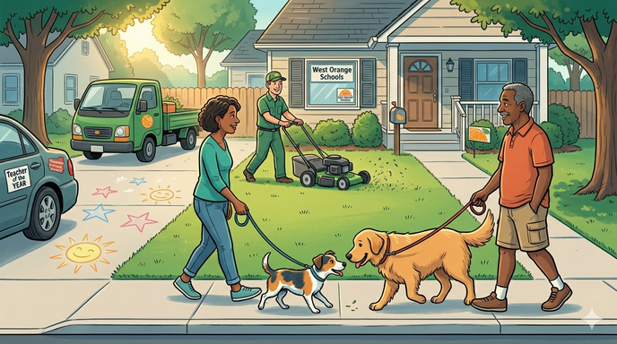
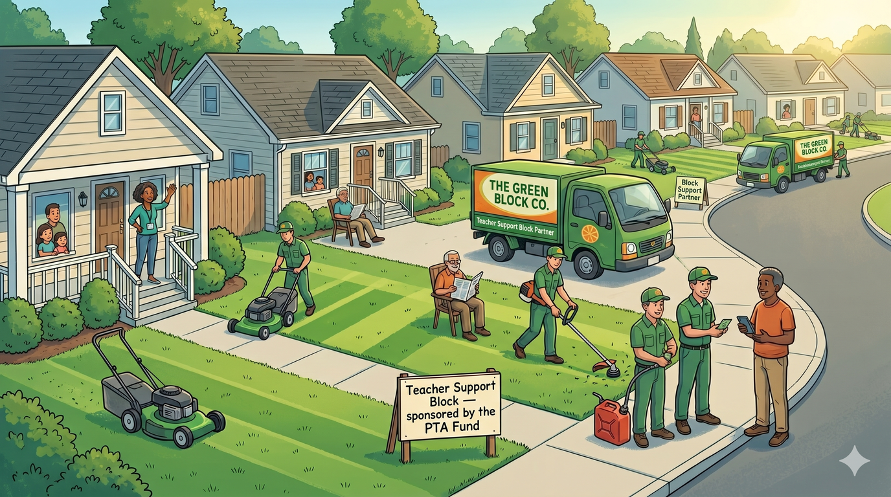

# Mutualism: Organized Neighborly Help

*Not "Mutualism" in any particular academic or political sense — just
neighbors helping neighbors, organized well enough that the help
actually lands. An emerging tactic worth prototyping alongside the
other Three-Prong ideas.*

---

## The idea in one paragraph

A teacher's paycheck isn't the only thing that shapes how much money
they keep. If the community can quietly absorb some of their recurring
non-school costs — through organized, non-threatening, tax-deductible
structures — that's functionally the same as a raise, without any of
the political or budget implications of an actual raise. Do it well
and it helps the teacher, gives donors something concrete to support,
lets a local business serve the community efficiently, and gives the
union a real reason to meet the district halfway on short-term wage
restraint. A small idea, but it compounds.

## A simple example: Lawncare

Consider an older teacher with health issues who pays about $100/month
for lawn maintenance — roughly $1,200/year they're spending just to
keep their yard in shape. They'd do it themselves if they could. They
can't.

One answer is the **one-on-one version**: a neighbor notices, reaches
out, and either pays for the service directly or does the work
themselves. That's lovely when it happens, but it depends on a
neighbor happening to know, happening to ask, and the teacher
happening to feel comfortable accepting. Most of the time that chain
doesn't line up, and the teacher keeps paying.

The **organized version** swaps the serendipity for structure:

1. The PTA (a 501(c)(3) non-profit) creates a small "Teacher Support"
   sub-fund — ideally on a transparent platform like
   [OpenCollective](16-pta-opencollective), so every dollar in and
   out is visible.
2. Neighbors who want to help donate to the fund. Because it's going
   through a non-profit, donations are **tax-deductible**.
3. The PTA collects a list of teachers who've opted in as beneficiaries
   — identifying themselves to the PTA, not publicly.
4. The fund **aggregates the work geographically**: a block of ten to
   twenty participating homes in the same neighborhood gets packaged
   as a single lawncare contract.
5. A local lawncare firm bids on the block. Because the firm can
   service all twenty houses on one trip — without moving the truck
   more than a few minutes — they can offer a meaningfully reduced
   price. They may offer an additional discount because the work is
   routed through a community non-profit and has local-reputation
   value attached.
6. The teacher pays nothing. The fund pays the firm. The donors
   deducted their gifts.

The teacher keeps $1,200/year of what was going out the door. Nobody's
pay changed. No line item appeared on the school budget. No red tape had to be snipped.

## The four-way win

| Who | What they get |
|-----|----------------|
| **Teacher** | ~$1,200/year in take-home equivalent, no awkwardness, dignified. |
| **Donor** | Tax-deductible giving with a tangible local outcome they can point to. |
| **Local firm** | Efficient bulk work, steady cash flow, community goodwill — a meaningful customer. |
| **Union / district** | A real-world channel for "our members are being supported" that isn't a wage negotiation. |

The last cell is politically important. Part of what makes the
[Prong 1 union sacrifice](bigger-picture-action#prong-1-right-now-tax-bridge--temporary-sacrifice)
hard is that asking for restraint feels like asking people to accept
less, period. If some of the erosion in take-home is being offset by
organized neighborly help, restraint becomes more defensible — both
to the negotiating union and to the members themselves.

This is the key distinction from the cost-cutting ideas elsewhere in
the whitepaper: mutualism *doesn't replace school work*. It doesn't
step on any union toe, doesn't outsource any teaching function, and
doesn't reduce any salary. It's purely additive — outside-work help
that happens to make inside-work compensation go further.

## Other services this pattern could absorb

Lawncare is a particularly clean example because the geographic
aggregation savings are obvious. But the pattern generalizes to any
recurring, locally-provided service where a firm can be more efficient
when serving a block rather than a scattered set of individual
customers. Candidates worth thinking about:

- **Snow removal.** Same seasonal / geographic logic as lawncare. In
  New Jersey, an especially expensive winter pain point for older
  teachers.
- **Minor home repairs.** A pool of pre-vetted local handypeople
  taking on small jobs — gutter cleaning, weatherstripping, replacing
  a leaking faucet, all coordinated to service one block at a time.
- **Meal trains during family emergencies.** Low-cost to organize,
  high-value to the recipient.
- **Pet care and small-animal needs.** Dog walks, sit-ins during long
  school days.
- **Grocery or pharmacy delivery** for teachers with health or
  mobility constraints.
- **Transportation support.** A teacher who's had to give up a car
  can be served by a shared-driver rotation or subsidized rideshare
  credits for school-related trips.
- **Summer enrichment swaps.** Teachers' own kids getting camp
  scholarships or tutoring swaps from other local teachers and
  parents during the unpaid summer gap.

Each is small; together, a handful at $50-$200/month each can add up
to meaningful help, without ever touching a salary line.

## How to start small

This is the kind of idea that dies if you try to launch all at once
and succeeds if you pilot a single narrow version and then grow it:

1. **Pick one service type.** Yard care is a nice starter, with
   geographically-obvious savings and a common paid service.
2. **Find teachers who'd participate.** Keep it quiet and
   dignified. The PTA can ask; teachers can opt in privately.
3. **Find volunteers willing to donate money or time.** Match them
   geographically to the beneficiary homes if possible.
4. **Set up the sub-fund** through the PTA's existing 501(c)(3) (or
   via [OpenCollective](16-pta-opencollective) if they haven't set
   one up yet). Only needed if not using volunteers with spare time.
5. **Run the pilot one season.** Document what worked, what broke,
   what the teachers and donors said.
6. **Report publicly** (with teacher privacy preserved) on the
   outcomes — dollars moved, services delivered, satisfaction.
7. **Expand.** Second service type. Or second neighborhood. Or both.

The point of starting small isn't modesty for its own sake — it's
that trust infrastructure is *exactly* the thing that takes practice
to build, and small pilots let you build it without much risk if you
get something wrong.

## Honest drawbacks

Same-as-always with this kind of civic invention: worth being upfront
about the trade-offs.

- **Privacy is a real challenge.** Nobody should be publicly labeled
  as "the teacher who needed help." Matching must be confidential,
  and public reporting has to be about outcomes, not individuals.
- **Some teachers will decline on principle** — the "I don't accept
  charity" response is common and deserves respect. The opt-in has
  to be private, genuinely optional, and never nagged.
- **Matching logistics need to scale.** At 5 teachers this
  runs on a spreadsheet and goodwill; at 50 it needs more of a dedicated
  platform - which is entirely doable with modern tools and volunteers.
- **Liability questions are real.** If a community-contracted
  lawncare firm damages a teacher's property, who's on the hook? The
  firm's own insurance usually, but contracts need to be written so
  the PTA isn't absorbing surprise liability.
- **Not a salary replacement, and shouldn't try to be.** The point is
  to help teachers keep more of what they earn, not to substitute
  for fair pay. The moment this is framed as "we're supporting
  teachers *instead of* raising salaries" it becomes toxic. The
  framing needs to stay "*in addition to* fair compensation."
- **Concentration risk.** If one well-meaning donor family funds most
  of the pilot, the fund's survival depends on their continued
  willingness. Breadth of contribution matters even at small scale.
- **Equity across teachers.** If only some teachers opt in, or only
  some benefit, the ones left out may notice. Clear criteria and
  ample communication matter.
- **Union optics need care.** Presented well, this reinforces union
  interests (members keeping more money, organized support
  infrastructure). Presented badly, it reads as "the community is
  doing what the employer should be doing." The union should be
  brought in early and invited to co-shape it, not surprised by it.

None of these drawbacks are reasons not to try. They're reasons to
start narrow, stay transparent, and treat the first season as a
prototype.

## How this connects to the rest of the whitepaper

- [**Sponsor a Neighbor (Tax Math)**](tax-math#sponsor-a-neighbor) is
  the 1:1 informal version of this idea — direct person-to-person
  cash transfer to cover a tax increase. Mutualism is the organized,
  aggregated, ongoing-service version. Both are useful; they solve
  different problems.
- [**The PTA as Community Operating System**](16-pta-opencollective)
  is the infrastructure this runs on. Without a visible non-profit
  fund that donors can see into, this idea stays informal and
  small. With one, it can scale.
- [**Community Sports**](19-community-sports) is another example of
  the same three-way pattern: community organization + district
  workforce + local service provider, all meeting in a non-profit
  arrangement.
- [**The Time Economy**](appendix-time-economy) is the philosophical
  context. If you accept that much of what we pay for is overhead
  accumulated between producer and consumer, then organizing
  community purchasing to cut that overhead is precisely the
  practical move the thinking points to.
- [**The Virtuous Spiral**](bigger-picture-spiral) is the effect
  compound-in-action. A teacher saving $100/month is not a school
  budget win per se. But a teacher saving $100/month is measurably
  less likely to leave the profession, which is a school budget win
  in disguise, because teacher retention is the single most expensive
  variable the district has.

---

## A final note

This is explicitly an *unfinished* idea. It's offered here as
prototype thinking, not a proposal ready for board action. If it
resonates with you — if you'd be interested in donating to a pilot,
or helping coordinate one, or you're a teacher who'd be willing to
be in the first opt-in cohort — reach out: **cervator@gmail.com**.

If enough people find this compelling to actually try, we'll upgrade
it from an appendix page to a full module with real coordination
infrastructure and a named fund.

---

Back to: [The Bigger Picture](bigger-picture) | [Tax Math](tax-math) | [The Time Economy](appendix-time-economy)
