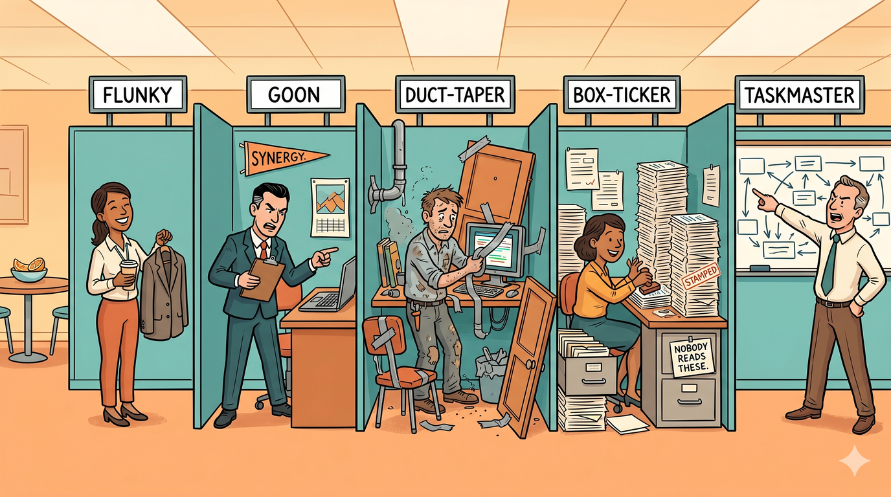
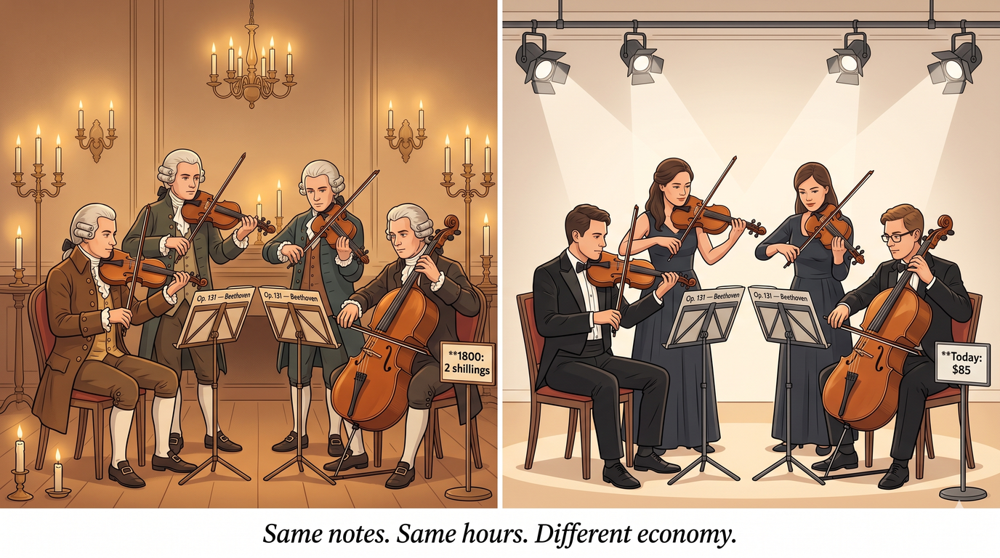

# The Time Economy: A Deeper Dive

*[The Void](bigger-picture-void) asked: what do things actually cost in
human time? That's not a new question. This is the academic lineage
behind the thought experiment, for readers who want to trace where the
ideas come from — and a few practical frames that map surprisingly
cleanly onto the school budget conversation.*

---

## The foundational idea: things "cost" whatever they took to produce

[Adam Smith](https://en.wikipedia.org/wiki/Adam_Smith) opened
*[The Wealth of Nations](https://en.wikipedia.org/wiki/The_Wealth_of_Nations)*
(1776) with a line that reads like it could sit at the top of the Void page:

> "The real price of every thing, what every thing really costs to the
> man who wants to acquire it, is the toil and trouble of acquiring it."

This is the
[**labor theory of value**](https://en.wikipedia.org/wiki/Labor_theory_of_value)
(LTV) in its earliest form — the classical economists' best answer to
"what determines price?"
[David Ricardo](https://en.wikipedia.org/wiki/David_Ricardo) sharpened
it in the early 1800s, framing the value of goods as the labor time
needed to produce them under typical conditions.

Modern mainstream economics moved past LTV in the 1870s with the
"[marginal revolution](https://en.wikipedia.org/wiki/Marginalism)" —
the idea that prices are determined by what
buyers subjectively value at the margin, not by any objective labor
content. Both frames have their uses, and contemporary economists still
argue about where each one applies best.

For our purposes, the important point is that the Void page's
thought experiment is really a throwback to the classical-labor framing
— not a serious pricing theory, but a **way of seeing** where overhead
has accumulated between producer and consumer. The difference between
"labor content" and "price paid" is where the extraction lives.

## Ivan Illich and "counter-productivity"

This is the single most striking parallel to the Void page, and the
one worth reading if you only read one thing.

[Ivan Illich](https://en.wikipedia.org/wiki/Ivan_Illich), an
Austrian-born philosopher-priest who spent most of his life in Mexico,
wrote a series of short, sharp books in the 1970s arguing that
institutions past a certain scale begin to **destroy the very thing
they were meant to produce** —
[*Deschooling Society*](https://en.wikipedia.org/wiki/Deschooling_Society)
(1971) for education,
[*Medical Nemesis*](https://en.wikipedia.org/wiki/Medical_Nemesis)
(1975) for healthcare,
[*Energy and Equity*](https://en.wikipedia.org/wiki/Energy_and_Equity)
(1974) for transportation.

His term for this was **counter-productivity**: past a tipping point,
each additional unit of an institution (another layer of bureaucracy,
another compliance requirement, another vendor) produces *less* of its
stated output, not more. The institution has crossed from serving its
purpose to serving itself.

> The bureaucracy is expanding to meet the needs of the expanding bureaucracy

A famous calculation from *Energy and Equity* is the closest twin to
the Void page's thought experiment. The average American driver,
Illich calculated, spends around 1,600 hours per year on their car —
working to afford it, maintaining it, fueling it, parking it, and
sitting in it in traffic. Driving roughly 7,500 miles annually, that
works out to an **effective speed of about 5 miles per hour. Walking
pace.**

His conclusion wasn't "cars are bad." It was that our tools had
exceeded the scale at which they serve us, and we now serve them.

Map that lens onto a school district: how many hours of an
administrator's day go to *the work of education* versus *the work of
managing the institution that manages education*? How many hours of a
teacher's week go to students versus to compliance? How many hours of
a parent's volunteering go to direct support versus to coordinating
with a coordinating agency? The Illich reading is that somewhere along
the line, we crossed the tipping point — and the way back isn't to
work harder, it's to shrink the institution toward its original scale.

*Energy and Equity* is a short pamphlet, widely available free online,
and reads like someone wrote it last week. It's the single best
follow-up to the Void page.

## The economics term for the toll booth: rent-seeking

The Spiral page calls it "extraction." The Void page draws middlemen
with toll booths. Both are describing what modern economics formally
calls [**rent-seeking**](https://en.wikipedia.org/wiki/Rent-seeking):
extracting wealth without creating any new value.

The term was coined by economist
[Gordon Tullock](https://en.wikipedia.org/wiki/Gordon_Tullock)
in 1967 and named by
[Anne Krueger](https://en.wikipedia.org/wiki/Anne_Krueger) in 1974.
It's one of the more bipartisan concepts in
economics — right-leaning economists use it to attack regulatory capture
and licensing cartels; left-leaning economists use it to attack
corporate rent extraction and monopoly pricing. Everyone agrees rent-
seeking is bad; what they disagree on is where the worst rent-seeking
lives.

In the school budget context, rent-seeking looks like:
- Brokers earning more when premiums go up
- Photo vendors locked into district contracts
- Staffing agencies taking 30-40% cuts of aide wages
- Administrative layers that exist to produce compliance reports for
  other administrative layers

The rent-seeking literature is enormous — start with the
[Wikipedia entry](https://en.wikipedia.org/wiki/Rent-seeking) as a
primer and follow the citations from there.
"[Regulatory capture](https://en.wikipedia.org/wiki/Regulatory_capture)"
([George Stigler](https://en.wikipedia.org/wiki/George_Stigler), 1971)
is the closest-cousin concept: the situation where agencies meant to
regulate an industry end up serving it instead.

## David Graeber and the anthropology of value

[David Graeber](https://en.wikipedia.org/wiki/David_Graeber) was an
American anthropologist (died 2020) whose popular books brought a lot
of these ideas to a mainstream audience.

- ***[Bullshit Jobs](https://en.wikipedia.org/wiki/Bullshit_Jobs)***
  (2018) argues that a significant fraction of modern white-collar
  work produces nothing of value even by the worker's own admission —
  jobs that exist to manage other jobs, to produce reports nobody
  reads, or to maintain institutional appearances. This is *exactly*
  what the Spiral page means by "administrative toil." Graeber's
  typology of five BS-job categories (flunkies, goons, duct-tapers,
  box-tickers, taskmasters) is a remarkably useful diagnostic lens.
  If you've ever sat in a meeting and wondered why you were there,
  Graeber has a name for your role.
- ***[Debt: The First 5,000 Years](https://en.wikipedia.org/wiki/Debt:_The_First_5000_Years)***
  (2011) argues that money and debt
  are much stranger, older, and more political than econ textbooks
  admit. He makes the case that credit/debt predates coin money by
  thousands of years, and that what we call "market exchange" is a
  relatively thin and recent layer on top of much older economies of
  gift and obligation. Dense but rewarding.

Graeber was anthropologist, not economist — which is why he got to ask
the *what is value actually* questions that the profession of economics
mostly brackets out as unanswerable.

## Time banking: putting the theory in practice

If labor time is the real underlying unit of value, what happens if you
try to build a currency out of it?

[**Time banking**](https://en.wikipedia.org/wiki/Time-based_currency)
(sometimes called "time dollars") was formalized by
[Edgar Cahn](https://en.wikipedia.org/wiki/Edgar_Cahn) in the 1980s.
The core idea: one hour of any person's service equals one hour of any
other person's service. A retired teacher tutoring a kid for an hour
earns one "time dollar." She can spend that time dollar to have a
neighbor rake her leaves for an hour. All labor is equal in the unit.

The economics are thin — you can't really run a large economy this way
— but the social and community dynamics are fascinating, and a number
of working time banks exist in the US and elsewhere. The
[**LETS**](https://en.wikipedia.org/wiki/Local_exchange_trading_system)
(Local Exchange Trading Systems) movement in the UK runs on similar
principles.
[**Ithaca HOURS**](https://en.wikipedia.org/wiki/Ithaca_Hours), active
from 1991 to 2015 or so, was the most famous US local-currency
experiment.

Time banking is less an economic theory than a community-building
practice. Worth looking at if the Void page's "what if all labor were
priced in time" framing resonates — there are people actually trying it.

## Baumol's cost disease (the honest counterweight)

Not all rising costs are extraction. Some of them are real, and pushing
on them in the wrong way will break the thing you're trying to save.

Economist [William Baumol](https://en.wikipedia.org/wiki/William_Baumol)
observed in the 1960s that
[**labor-intensive sectors that can't easily gain productivity**](https://en.wikipedia.org/wiki/Baumol%27s_cost_disease) —
education, healthcare,
live performance, personal services — see their costs rise faster than
sectors where machines and automation keep improving output per hour.
The reason isn't that the sectors are inefficient; it's that *other*
sectors got efficient, so wages had to rise across the board, and the
labor-intensive sectors got more expensive in relative terms even
though their actual work didn't change.

A string quartet performs Beethoven's Opus 131 in the same number of
player-hours today as in 1800. But players today have to earn enough
to live in a modern economy, so concert tickets have to cost more.
You can't "automate" the quartet without destroying what it is.

Schools run into Baumol hard. You can't productively squeeze the hours
of student-teacher interaction — that *is* the product. When teachers'
salaries rise to match a more productive economy around them, school
costs rise, and it's not because anyone is extracting anything.

This matters for the West Orange conversation because **not every
rising line item is extraction**. Some of it is Baumol. The work of
distinguishing one from the other is where the real policy thinking
lives. The [Virtuous Spiral](bigger-picture-spiral) page's framework
("natural cost vs. extraction cost") is essentially a lay version of
this distinction.

## Supporting threads worth knowing

### [E.F. Schumacher](https://en.wikipedia.org/wiki/E._F._Schumacher) — *[Small is Beautiful](https://en.wikipedia.org/wiki/Small_Is_Beautiful)* (1973)

The tagline is "economics as if people mattered." Schumacher was a
former chief economist at the UK's National Coal Board who, after a
trip to Burma, spent the rest of his career arguing for **human-scale
economics**: institutions small enough to be legible, technologies
simple enough to be locally maintainable, economies organized around
what people actually need. The book coined the term
"[intermediate technology](https://en.wikipedia.org/wiki/Intermediate_technology)."
You can hear its echo in the Three-Prong Plan's whole "community
exoskeleton" framing.

### [Elinor Ostrom](https://en.wikipedia.org/wiki/Elinor_Ostrom) — *Governing the Commons* (1990)

Ostrom won the 2009 Nobel in Economics for showing empirically that
**commons — shared resources like fisheries, grazing land, irrigation
systems — can be governed sustainably without either markets or
centralized states.** Communities that successfully manage shared
resources share certain design principles: clear boundaries, collective
rules set by users, graduated sanctions, mechanisms for conflict
resolution, and so on. If you think about a PTA, a volunteer
maintenance corps, or a community photography collective as a "commons"
— a shared resource the community manages together — Ostrom's eight
design principles are a remarkably practical checklist.

### [Ronald Coase](https://en.wikipedia.org/wiki/Ronald_Coase) — "[The Nature of the Firm](https://en.wikipedia.org/wiki/The_Nature_of_the_Firm)" (1937)

Coase's question was: why do firms exist at all? If markets are so
efficient, why don't we all just freelance every transaction? His
answer: because coordinating through markets has **transaction costs**
(search, negotiation, enforcement), and sometimes it's cheaper to do
things inside an organization than through contracts. This is the
foundational paper of modern organizational economics. The relevance
to school districts: every time the district signs a long-term vendor
contract, they're trading one set of transaction costs (market-like,
per-decision) for another (internal, per-organization). The
[RFI Templates](07-rfi-templates) module is essentially Coase applied
as activism.

### Bastiat's broken window (1850)

[Frédéric Bastiat](https://en.wikipedia.org/wiki/Fr%C3%A9d%C3%A9ric_Bastiat)'s
short essay
"[That Which is Seen and That Which is Not Seen](https://en.wikipedia.org/wiki/That_Which_Is_Seen_and_That_Which_Is_Not_Seen)"
introduced the
[**broken window fallacy**](https://en.wikipedia.org/wiki/Parable_of_the_broken_window):
if a vandal breaks
a shopkeeper's window, is the economy stimulated by the glazier's new
business? Of course not — the shopkeeper's money was going to be spent
on *something else*, and now that something else is foregone. The
broken window produced activity, not wealth.

The relevance: **activity isn't productivity**, and "creating jobs" by
producing work that didn't need to exist isn't economic help. Much of
administrative bloat is defended on the grounds that it "creates jobs,"
but Bastiat would ask: what are those people *not* doing because they're
instead producing compliance reports?

### [Kate Raworth](https://en.wikipedia.org/wiki/Kate_Raworth) — *[Doughnut Economics](https://en.wikipedia.org/wiki/Doughnut_%28economic_model%29)* (2017)

The modern attempt to rewrite Econ 101 around humane and planetary
bounds. Raworth argues for a "safe and just operating space" between
a social floor (things no human should live below — food, housing,
education, political voice) and an ecological ceiling (things the
planet can't sustain). Accessible and visually clever. Worth reading
if the Illich framing feels too radical and you want a more
contemporary, constructive alternative.

## How these lenses map onto the school budget conversation

For fun, here's what each thinker's lens sees when pointed at the West
Orange crisis:

| Lens | What it sees |
|------|--------------|
| **Smith / Ricardo** | The underlying labor cost of teaching a class hasn't changed much in 50 years. The price has. Where did the delta go? |
| **Illich** | The administration-to-education ratio has crossed the counter-productive tipping point. Shrink the institution, not the staff. |
| **Rent-seeking** | Brokers, vendors, staffing agencies, compliance consultants — all classic rent positions. Remove one, save compounding amounts. |
| **Graeber** | How much of district admin work is producing actual educational value vs. managing other district admin work? |
| **Baumol** | Teacher salaries *should* rise with the economy. That's not extraction. Don't confuse this with the rent layer. |
| **Schumacher** | The "community exoskeleton" is the right scale because it's human-sized — neighbors helping neighbors, not another agency. |
| **Ostrom** | Community-run photography, maintenance, grants — these are commons. Design them with Ostrom's principles in mind. |
| **Coase** | Every vendor contract is a transaction-cost trade. RFIs and shared services force the district to show its work on those trades. |
| **Bastiat** | "But it creates jobs!" as a defense of administrative bloat is the broken window fallacy wearing a tie. |
| **Raworth** | The goal isn't to shrink spending — it's to stay inside a safe operating space where the system works for both kids and taxpayers. |

## Further reading

- Illich, *[Energy and Equity](https://en.wikipedia.org/wiki/Energy_and_Equity)*
  (1974) — short pamphlet, available free online. Start here.
- Illich, *[Deschooling Society](https://en.wikipedia.org/wiki/Deschooling_Society)*
  (1971) — applies the same lens to education specifically. Provocative.
- Graeber, *[Bullshit Jobs](https://en.wikipedia.org/wiki/Bullshit_Jobs)*
  (2018) — fun and accessible.
- Graeber, *[Debt: The First 5,000 Years](https://en.wikipedia.org/wiki/Debt:_The_First_5000_Years)*
  (2011) — longer, denser, rewarding.
- Schumacher, *[Small is Beautiful](https://en.wikipedia.org/wiki/Small_Is_Beautiful)*
  (1973) — still holds up.
- Ostrom, *Governing the Commons* (1990) — academic but foundational.
  See [Elinor Ostrom's Wikipedia page](https://en.wikipedia.org/wiki/Elinor_Ostrom).
- Raworth, *[Doughnut Economics](https://en.wikipedia.org/wiki/Doughnut_%28economic_model%29)*
  (2017) — the accessible modern overview.
- [Tullock](https://en.wikipedia.org/wiki/Gordon_Tullock) and
  [Krueger](https://en.wikipedia.org/wiki/Anne_Krueger) on
  [rent-seeking](https://en.wikipedia.org/wiki/Rent-seeking) — start
  with the Wikipedia entry for a readable overview; follow the
  citations from there.

None of these books *agree* with each other on everything — in fact
several actively disagree. But they're asking the same family of
questions the Void page is asking, and they've been asking them for a
while. Whatever else you take from the list, Illich's 5-miles-per-hour
calculation is the one that will haunt you at a stoplight.

---

Back to: [The Void](bigger-picture-void) | [The Virtuous Spiral](bigger-picture-spiral) | [The Bigger Picture](bigger-picture)
