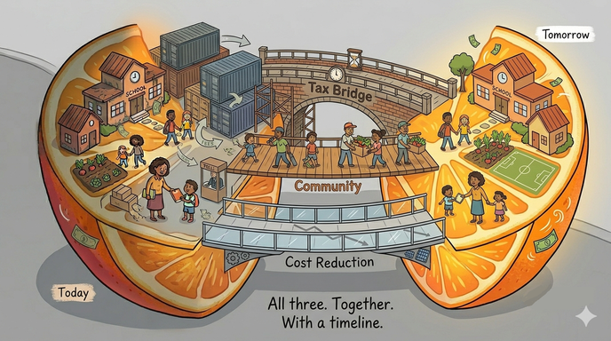

# The Action Plan

*From theory to three prongs: fix the right now, fix the process, fix the economics.*

[](images/ThreeProngBridge.png)

---

## Good Deflation vs. Bad Deflation

Most people hear "deflation" and think economic collapse - the Great
Depression, where prices fell because nobody could afford to buy anything,
businesses closed, and the spiral fed on itself. That's **demand-collapse
deflation** and it's genuinely catastrophic.

What we're describing is something completely different: **overhead-removal
deflation**. The demand doesn't change - kids still need to be taught, people
still need healthcare, buildings still need roofs. What changes is the cost
of delivering it, because intermediary layers get thinner or disappear.

| | Bad Deflation | Good Deflation |
|---|---|---|
| **Why prices drop** | Nobody can afford to buy | The overhead got removed |
| **What happens to workers** | Lose jobs, can't find new ones | Same work, less toll extracted from it |
| **What happens to quality** | Degrades as everyone cuts corners | Maintains or improves - the work itself didn't change |
| **What happens to demand** | Collapses - downward spiral | Stays the same or grows - people have more capacity |
| **Historical parallel** | 1930s Depression | Technology-driven cost reduction (computing, solar, communication) |

Think about what happened to the cost of computing. In 1980 a megabyte of
storage cost thousands of dollars. Today it costs a fraction of a cent. Did
the computing industry collapse? No - it exploded. The deflation in cost
*created* demand rather than destroying it. More people could afford
computers, which created more use cases, which drove more innovation, which
drove costs down further. A virtuous spiral.

The same thing happened with solar energy, communication costs, and
information access. When the cost of something drops because the *means of
production* improved rather than because *demand collapsed*, it's a gift,
not a crisis.

## The Time Dividend

Here's where it gets interesting for our school district.

When tooling reduces administrative overhead, the administrator doesn't
disappear - they get *time back*. That time can go to grant research,
community coordination, or program development. The district didn't cut a
position; it made an existing position more effective.

When a parent uses better coordination tools to organize volunteers in
2 hours instead of 10, those 8 hours come back. Some of that time goes
to... life. Rest. Family. That's not wasted - that's the point. But some
of it might go to volunteering at the school. Not because they have to,
but because they now *can*.

This is the community exoskeleton in its mature form: people volunteering
not out of desperation ("the school will collapse if we don't") but out of
engagement ("I have time and I'd rather spend it with my neighbors' kids
than billing hours for a corporation").

### The volunteer-as-partial-replacement model

Consider the enrichment example from Module 1. The district can't afford
to keep art at 45 minutes. The PTA steps in to fund the gap. But what if,
over time, costs come down enough - through better healthcare deals, less
administrative overhead, community-sourced materials - that the district
can absorb more of it again?

Meanwhile the teacher's cost of living has also dropped slightly: healthcare
costs less, maybe housing stabilizes, community resources stretch further.
The teacher doesn't need as large a salary to live well. Not because they
were *cut*, but because things genuinely *cost less*.

The volunteer who was covering the gap can shift from "keeping the lights
on" to "making things better" - running an after-school robotics club
because they want to, not because the school will close without them.

That's the transition: from emergency volunteering to enrichment
volunteering. From survival to community building. The gentle deflationary
spiral makes it possible because it gives everyone - teachers, parents,
administrators, volunteers - a little more room to breathe.

## The Three-Prong Plan

None of these prongs works alone. Together, they form a coherent multi-year
strategy where each justifies the others.

### Prong 1: Right Now (Tax Bridge + Temporary Sacrifice)

*Timeline: Months. Ownership: Board + union + community solidarity.*

Some pain is unavoidable. But it should be *justified* pain, not aimless
annual increases with no plan. Specifically:

**Use the health insurance tax levy exception.** NJ law already allows
school districts to [exceed the 2% tax cap specifically for healthcare cost
increases](https://njpsa.org/new-jersey-school-finance-2024-property-tax-caps-and-state-aid-a-look-at-the-numbers/).
With SEHBP recommending a 29.7% premium increase for 2026, this exception
exists precisely for this moment. The increase isn't unlimited - it's capped
at the average state plan increase percentage - but it provides real room.

**Protect those who can't afford it.** A flat tax increase hits a retiree
on fixed income the same as a dual-income household. Options:
- Strengthen existing NJ property tax relief programs (Senior Freeze,
  Homestead Benefit) through better outreach - many eligible residents
  don't know they qualify
- A community-funded "tax relief" pool where willing residents voluntarily
  cover the increase for a neighbor who can't - the same "sponsor a neighbor"
  model that works for PTA memberships and school photos
- Phase the increase with a sunset clause: this is a bridge, not a
  permanent raise, and it shrinks as prongs 2 and 3 take effect

**Ask the union for a temporary sacrifice.** This is politically
explosive, but it's honest: if the community is stepping up (prong 2)
and investing in long-term cost reduction (prong 3), the union can
contribute by accepting a temporary freeze or modest concession - not a
permanent reduction, but a bridge. The key word is *temporary*, backed
by a credible plan to restore and improve. Without a plan, a freeze is
just a cut. With a plan, it's an investment.

### Prong 2: This Year and Ongoing (Community Gets to Work)

*Timeline: Weeks to months to start preparing, ongoing. Ownership:
Community starts building, district collaborates to execute.*

The community can begin preparing right away - researching, organizing,
building platforms, recruiting volunteers. Some of these need district
collaboration to fully execute, but the groundwork doesn't require
permission:

- [Instructional Bridge Grant](01-instructional-bridge) - PTA explores
  funding models to help preserve art/library instruction
- [Open Image Project](02-open-image-project) - build a community
  photography platform and recruit volunteer photographers
- [Community Maintenance](03-community-maintenance) - explore volunteer
  coordination for grounds upkeep, starting with what's feasible
- [Community Sports](19-community-sports) - connect with local leagues,
  recruit high schoolers as assistant coaches for volunteer hours, explore
  shared-use possibilities
- [Grant Writing](11-grant-writing) - community expertise identifying and
  pursuing funding the district hasn't had bandwidth to chase
- [Open Governance](06-open-governance) - improve how we communicate and
  collaborate so the conversations in Prong 3 can actually happen
  productively
- [Open Budget Tools](14-open-budget-tools) - make the numbers visible so
  everyone's working from the same facts

[Paraprofessional Retention](04-paraprofessional-audit) is the *goal* -
the position the community can't replace, protected by savings from
everything above.

This prong justifies prong 1 ("we're not just raising taxes - the
community is actively shouldering what it can") and creates the
coordination and transparency infrastructure that makes prong 3 possible.

### Prong 3: Multi-Year Structural Changes (Community Researches, District Executes)

*Timeline: Months to years. Ownership: District executes, community
helps research, prepare, and advocate.*

These are deeper changes that require district authority - contracts to
sign, plans to switch, agreements to negotiate. The community can do
the research, run the numbers, prepare the RFIs, and build the case.
But an administrator needs to submit the procurement request.

- **Healthcare:** [Direct provider relationships, reference-based pricing,
  community-scale dual plan](05-health-insurance) - the biggest single
  lever and the hardest to pull. The district signs the contracts;
  community members with insurance, healthcare, or finance expertise
  can research options and model scenarios.
- **Energy:** [Solar PPAs, LED retrofits, utility-funded audits](09-energy-facilities) -
  permanent savings that compound annually. The district executes the
  agreement; the community can identify vendors and model savings.
- **Procurement:** [Cooperative purchasing, shared services](10-cooperative-purchasing)
  with neighboring districts using existing NJ frameworks. Requires
  inter-district agreements.
- **Regulatory:** [Using existing state tools](13-regulatory-leverage) -
  banked cap, Best Practices, cooperative frameworks. District decisions,
  informed by community research.
- **Administration:** Tooling to reduce overhead, freeing staff time for
  grant research, community coordination, and program development.

Each structural cost removed passes savings forward. Each savings makes
the next round easier. Over years - not months - the cost base shifts
downward. The tax increases from prong 1 can phase out. The volunteer
burden from prong 2 can shift from survival to enrichment.

### How the three prongs reinforce each other

```
Prong 1 (Tax Bridge)          Prong 2 (Community)      Prong 3 (Structural)
         │                           │                        │
    Buys time ──────────────→ Starts working ────────→ Reduces costs
         │                           │                        │
    Justified by ←─────────── Enabled by ←─────────── Sustained by
    community action            transparency              lasting savings
```

Without prong 1, the system collapses before prongs 2 and 3 can work.
Without prong 2, prong 1 is just throwing money at a broken system.
Without prong 3, prong 1 repeats forever and prong 2 burns out volunteers.

All three. Together. With a timeline.

## The Long Game

If this works - if the community can measurably reduce extraction costs
in even a few areas - it proves something important: **costs don't have to
go up.** The spiral can run in reverse. And every community that proves it
in one area gives every other community a template for doing the same.

That's the bigger vision: not one school district saving money, but a
pattern that spreads. Globalize the solution, localize the implementation.
The recipe is shareable. The cooking is always local.

The school board crisis is where this starts. Not because it's the biggest
problem, but because it's the one where the community already showed up -
a thousand strong, past midnight, because they care. That energy deserves
a better outlet than three-minute soundbites at a wall.

And maybe, if we get it right, the next generation grows up in a community
where the default isn't scarcity and extraction but sufficiency and
engagement. Where you volunteer because you want to, work because it's
meaningful, and the systems that serve you don't cost more than the service
is worth.

That's not utopia. It's just a community where the pie stopped shrinking.

---

Back to: [The Bigger Picture](bigger-picture)
