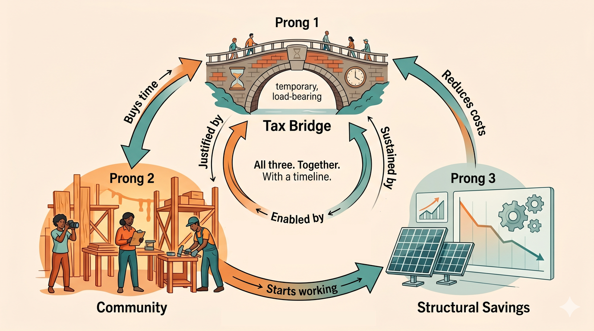

# The Action Plan

*From theory to three prongs: fix the right now, fix the process, fix the economics.*

---

The [Virtuous Spiral](bigger-picture-spiral) makes the case that costs
*can* go down - not through painful cuts but by removing overhead and
letting savings compound. It distinguishes
[good deflation from bad](bigger-picture-spiral#good-deflation-vs-bad-deflation),
shows how reduced overhead creates a
[time dividend](bigger-picture-spiral#the-time-dividend) for the community,
and maps how each
[whitepaper module](bigger-picture-spiral#applying-this-to-the-school-district)
targets a different type of saving.

This page is what we actually *do* with that theory.

## The Three-Prong Plan

None of these prongs works alone. Together, they form a coherent multi-year
strategy where each justifies the others.

### Prong 1: Right Now (Tax Bridge + Temporary Sacrifice)

*Timeline: Months. Ownership: Board + union + community solidarity.*

**The proposal.** NJ law already allows school districts to
[exceed the 2% tax cap specifically for healthcare cost
increases](https://njpsa.org/new-jersey-school-finance-2024-property-tax-caps-and-state-aid-a-look-at-the-numbers/).
With SEHBP recommending a 29.7% premium increase for 2026, this exception
exists precisely for this moment. The idea is to use it to temporarily
provide the district more revenue now — while prongs 2 and 3 build the
structural savings that let the increase wind down over time. (For
finance-minded readers who want the full mechanics of how NJ levy caps
and exceptions work, Planet Princeton has
[a good primer](https://planetprinceton.com/2024/12/21/a-primer-on-public-schools-and-property-tax-caps-in-n-j/).)

**The investment case.** Think of this like a surge deployment - similar
to how COVID emergency funding was explicitly temporary, meant to keep
systems alive while they adapted. We're asking the community to invest
more *now* so the school system can modernize and become more cost-
effective *after*. The tax increase isn't a permanent new cost of living
- it's a time-limited bridge that funds stability while prongs 2 and 3
reduce the structural cost base. By year 2-3, the process improvements
and cost reductions should start producing measurable dividends.

Some pain is unavoidable. But it should be *justified* pain, not aimless
annual increases with no plan. Specifically:

**Protect those who can't afford it.** A flat tax increase hits a retiree
on fixed income the same as a dual-income household. Options:
- Strengthen existing NJ property tax relief programs (Senior Freeze,
  Homestead Benefit) through better outreach - many eligible residents
  don't know they qualify
- A community-funded "tax relief" pool where willing residents voluntarily
  cover the increase for a neighbor who can't - the same "sponsor a neighbor"
  model that could work for PTA memberships and school photos. See
  [Tax Math](tax-math#sponsor-a-neighbor) for what this could actually
  look like, including a worked-out example of what the increase costs
  per household and an offer to help organize the matching.

**Commit to sunsetting the surge.** The extra revenue from the health
insurance exception should be paired with a public commitment: as Prong 3
savings (healthcare reform, solar PPAs, cooperative purchasing) come
online, the board votes to reduce the levy proportionally rather than
spending the savings elsewhere. One board can't legally bind a future
board on tax rates, so this has to be a political promise backed by
community oversight - ideally an annual "sunset report" from the board
showing what savings materialized and how much of the surge has been
wound down. Without that discipline, the temporary bridge quietly becomes
permanent.

**Ask the union for a temporary sacrifice.** This is politically
explosive, but it's honest: if the community is stepping up (prong 2)
and investing in long-term cost reduction (prong 3), the union can
contribute by accepting a temporary freeze or modest concession - not a
permanent reduction, but a bridge. The key word is *temporary*, backed
by a credible plan to restore and improve. Without a plan, a freeze is
just a cut. With a plan, it's an investment. The case becomes more
honest still if the community is also actively helping members keep
more of what they already earn — see the [Mutualism](appendix-mutualism)
appendix for an organized way the community can defray non-work costs
for teachers without touching the salary line.

**Let natural attrition work.** If the tax bridge buys three years of
stability, normal retirement and turnover will create openings that
don't need to be refilled - far less painful than forced cuts. A soft
hiring freeze (fill only truly critical positions, leave others open if
capacity allows) combined with the community exoskeleton absorbing some
functions could meaningfully shrink the gap without anyone losing their
job. Attrition only works as a strategy if you have time. The tax bridge
buys that time.

### Prong 2: This Year and Ongoing (Community Gets to Work)

*Timeline: Weeks to months to start preparing, ongoing. Ownership:
Community starts building, district collaborates to execute.*

The community can begin preparing right away - researching, organizing,
building platforms, recruiting volunteers. Some of these need district
collaboration to fully execute, but the groundwork doesn't require
permission:

- [Instructional Bridge Grant](01-instructional-bridge) - PTA explores
  funding models to help preserve art/library instruction
- [Open Image Project](02-open-image-project) - build a community
  photography platform and recruit volunteer photographers
- [Community Maintenance](03-community-maintenance) - explore volunteer
  coordination for grounds upkeep, starting with what's feasible
- [Community Sports](19-community-sports) - connect with local leagues,
  recruit high schoolers as assistant coaches for volunteer hours, explore
  shared-use possibilities
- [Grant Writing](11-grant-writing) - community expertise identifying and
  pursuing funding the district hasn't had bandwidth to chase
- [Open Governance](06-open-governance) - improve how we communicate and
  collaborate so the conversations in Prong 3 can actually happen
  productively
- [Open Budget Tools](14-open-budget-tools) - make the numbers visible so
  everyone's working from the same facts

[Paraprofessional Retention](04-paraprofessional-audit) is the *goal* -
the position the community can't replace, protected by savings from
everything above.

This prong justifies prong 1 ("we're not just raising taxes - the
community is actively shouldering what it can") and creates the
coordination and transparency infrastructure that makes prong 3 possible.

### Prong 3: Multi-Year Structural Changes (Community Researches, District Executes)

*Timeline: Months to years. Ownership: District executes, community
helps research, prepare, and advocate.*

These are deeper changes that require district authority - contracts to
sign, plans to switch, agreements to negotiate. The community can do
the research, run the numbers, prepare the RFIs, and build the case.
But an administrator needs to submit the procurement request.

- **Healthcare:** [Direct provider relationships, reference-based pricing,
  community-scale dual plan](05-health-insurance) - the biggest single
  lever and the hardest to pull. The district signs the contracts;
  community members with insurance, healthcare, or finance expertise
  can research options and model scenarios.
- **Energy:** [Solar PPAs, LED retrofits, utility-funded audits](09-energy-facilities) -
  permanent savings that compound annually. The district executes the
  agreement; the community can identify vendors and model savings.
- **Procurement:** [Cooperative purchasing, shared services](10-cooperative-purchasing)
  with neighboring districts using existing NJ frameworks. Requires
  inter-district agreements.
- **Regulatory:** [Using existing state tools](13-regulatory-leverage) -
  banked cap, Best Practices, cooperative frameworks. District decisions,
  informed by community research.
- **Administration:** Tooling to reduce overhead, freeing staff time for
  grant research, community coordination, and program development.

Each structural cost removed passes savings forward. Each savings makes
the next round easier. Over years - not months - the cost base shifts
downward. The tax increases from prong 1 can phase out. The volunteer
burden from prong 2 can shift from survival to enrichment.

### How the three prongs reinforce each other

Without prong 1, the system collapses before prongs 2 and 3 can work.
Without prong 2, prong 1 is just throwing money at a broken system.
Without prong 3, prong 1 repeats forever and prong 2 burns out volunteers.

All three. Together. With a timeline.

## The Long Game

If this works - if the community can measurably reduce extraction costs
in even a few areas - it proves something important: **costs don't have to
go up.** The spiral can run in reverse. And every community that proves it
in one area gives every other community a template for doing the same.

That's the bigger vision: not one school district saving money, but a
pattern that spreads. Globalize the solution, localize the implementation.
The recipe is shareable. The cooking is always local.

The school board crisis is where this starts. Not because it's the biggest
problem, but because it's the one where the community already showed up -
a thousand strong, going past midnight, because they care. That energy deserves
a better outlet than three-minute soundbites at a polite wall.

And maybe, if we get it right, the next generation grows up in a community
where the default isn't scarcity and extraction but sufficiency and
engagement. Where you volunteer because you want to, work because it's
meaningful, and the systems that serve you don't cost more than the service
is worth.

That's not utopia. It's just a community where the pie stopped shrinking.

---

Back to: [The Bigger Picture](bigger-picture)
