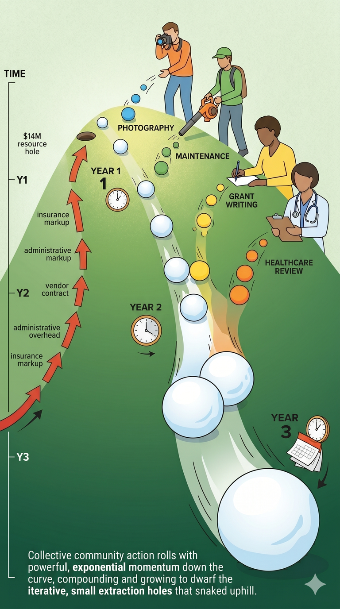

# The Virtuous Spiral: What If Costs Went Down?

*Distinguishing greed from genuine cost, and how every savings passed forward
creates the next one.*

---

We're conditioned to accept that costs always go up. Healthcare premiums
increase every year. Textbook prices rise every edition. Insurance, compliance,
administration - everything trends upward. We call it inflation and treat it
like weather: inevitable, impersonal, beyond anyone's control.

But not all cost increases are the same. Some are real. Some are extraction.
And the difference matters enormously - because only one of them is fixable
at the local level.

## Two Kinds of "Expensive"

### Natural cost (hard to avoid)

- Raw materials genuinely cost more (lumber prices, fuel prices)
- Skilled labor is scarce and people deserve fair pay
- Genuine quality improvements require investment (better medical technology,
  safer buses, more effective teaching methods)
- Regulatory compliance that addresses real safety or equity concerns

These are honest costs. They reflect real value or real scarcity. When lumber
prices rise because forests are depleted, that's a signal to use less lumber
or find alternatives. When a teacher's salary rises because we value education,
that's a community choice.

### Extraction cost (created by intermediaries)

- A textbook that costs the same to produce but
  [costs 1,041% more](https://www.nbcnews.com/feature/freshman-year/college-textbook-prices-have-risen-812-percent-1978-n399926)
  than it did in 1977
- An aspirin that costs pennies to make but
  [$25 in a hospital](https://www.healthcarefinancenews.com/medtech-blog/why-aspirin-taken-hospital-can-cost-upwards-25)
- An insurance broker who
  [earns more when your premiums go up](https://jerseyvindicator.org/2026/01/28/new-jersey-school-district-missed-49-million-in-savings-by-skipping-state-health-plan-audit-finds/)
- A staffing agency that takes 30-40% of each worker's billing rate as
  overhead while the worker themselves may struggle to make ends meet
- Administrative layers that exist to manage other administrative layers

These aren't real costs. They're tolls. Someone built a booth on the road
between "person who does the work" and "person who needs the work done" and
charges both sides for passage. Each toll was justified once ("quality
assurance," "risk management," "compliance"), but the toll has long since
exceeded the value of what it was supposed to protect.

## The Spiral Downward (the good kind)

Here's what makes extraction costs different from natural costs: **they can
be removed.** And when you remove one, something interesting happens.

### The chain reaction

Imagine the school district switches from a commercial insurance broker to a
direct arrangement with the state plan or a reference-based pricing model
(paying providers [140-160% of Medicare rates](https://www.shrm.org/topics-tools/news/benefits-compensation/reference-based-pricing-another-self-insured-option-employers)
instead of the typical 250%). Healthcare costs drop - maybe not 30% overnight,
but measurably.

That savings means:
1. **The district can retain staff** it was going to cut - those salaries
   stay in the local economy
2. **Teachers spend less on their own healthcare** contributions - they have
   more to spend locally
3. **The PTA needs to fundraise less** to cover the gap - volunteer energy
   goes to enrichment instead of survival
4. **Property values stabilize** because the school system isn't visibly
   collapsing - families stay, tax base holds

Each step feeds the next. The savings *compound* through the community.

Now imagine that same logic applied to multiple extraction points
simultaneously:
- [Community-run photography](02-open-image-project) eliminates the Lifetouch middleman
- [Volunteer maintenance](03-community-maintenance) eliminates the contractor premium
- A [grant writing team](11-grant-writing) brings in external funding
- [Direct provider relationships](05-health-insurance) reduce healthcare overhead

Each one is modest on its own. Together, they shift the ratio of the pie
back toward the community. The virtuous spiral is the opposite of the
extraction creep described in [The Void](bigger-picture-void) - instead
of each intermediary adding cost, each removal passes savings forward.

### Snowballs, not silver bullets

It's easy to look at a $14 million deficit and dismiss community efforts as
too small to matter. A volunteer leaf-blowing brigade doesn't close a $14M
gap. A PTA photography fundraiser doesn't close it either. No single module
in this whitepaper does.

But that's not how compounding works.

Each small saving is a snowball. The tax levy increase
([Prong 1](bigger-picture-action#prong-1-right-now-tax-bridge--temporary-sacrifice))
buys time - it keeps the system alive while the snowballs start rolling.
Each community effort
([Prong 2](bigger-picture-action#prong-2-this-year-and-ongoing-community-gets-to-work))
is a snowball that frees up a bit of budget. Each structural cost removed
([Prong 3](bigger-picture-action#prong-3-multi-year-structural-changes-community-researches-district-executes))
is a snowball that rolls downhill and picks up mass.

A $50,000 [grant writing](11-grant-writing) win funds a position. That
position's healthcare costs $15,000 less because the district
[switched to a better plan](05-health-insurance). That savings funds half
a [solar PPA](09-energy-facilities) assessment. The solar PPA saves
$30,000/year in energy costs. That $30,000 covers a
[para](04-paraprofessional-audit) who was going to be cut. That para's
retention avoids a potential due-process lawsuit that would have cost ten
times more.

No single step is dramatic. But like compound interest, the gains accelerate
over time because each round starts from a higher base. The first year is
grinding. The second year is momentum. By the third year, the community
wonders why it ever accepted the old cost structure.

The $14M hole wasn't created in one year either. It accumulated through
years of small extraction increases - a bit more here for insurance, a bit
more there for vendor contracts, a bit more for compliance overhead. The
spiral works in both directions. We just need to reverse the direction.

## The Tooling Multiplier

This is where modern technology changes the equation. Not "AI replacing
teachers" - that's a fear, not a plan. The multiplier is in the overhead:

**Administrative toil.** A school administrator spends hours on procurement
paperwork, compliance reporting, budget spreadsheets, and vendor management.
If tooling cuts that from 20 hours/week to 5 hours/week, the other 15 hours
can go to: grant research, community outreach, program development, or
simply a less burned-out administrator who makes better decisions.

**Coordination overhead.** Organizing 50 volunteers used to require a
full-time coordinator. With modern scheduling tools, commitment tracking,
and group communication, one part-time organizer can manage it. The
coordination tax drops, which means more of the volunteer's time goes to
actual work.

**Information access.** Budget data locked in 200-page PDFs is effectively
secret. The same data in an interactive visualization is democratic. When
parents can see where money goes, the conversation changes from "trust us"
to "let's work on this together." The cost of transparency drops to near
zero.

Each of these is a form of deflation - not in the scary macroeconomic sense,
but in the practical sense of "this used to cost more time/money than it
needs to." Every hour of toil eliminated is an hour returned to the
community. Every dollar of overhead removed is a dollar that stays in the
local slice of the pie.

## How to Tell the Difference

When someone says "costs are going up," ask:

| Question | If the answer suggests... | It's probably... |
|----------|--------------------------|-----------------|
| Did the *work itself* get harder or more complex? | New medical procedures, harder curriculum standards | Natural cost |
| Did the *intermediary layer* grow? | New billing requirements, new compliance vendors, new middlemen | Extraction cost |
| Would a competitor charge less? | Yes, but switching costs are prohibitive | Lock-in (extraction) |
| Does the price drop dramatically when a patent expires or a contract ends? | Yes (like Lyrica: [$8 → under $0.25](https://www.goodrx.com/pregabalin) when generics arrived) | The original price was extraction |
| Is the provider being paid fairly? | No - the worker gets a fraction of what's charged | The markup is going to intermediaries |

This isn't about declaring all costs illegitimate. Teachers deserve good pay.
Doctors deserve good pay. Quality materials cost what they cost. The target
is the *gap* between what the worker earns and what the consumer pays - the
extraction layer that benefits neither side.

## Applying This to the School District

The community exoskeleton from the whitepaper targets savings in different
ways - some remove extraction, some bring in new revenue, some replace paid
services with volunteer capacity:

| Module | Type of saving | How |
|--------|---------------|-----|
| [Bridge Grant](01-instructional-bridge) | Cost shift | PTA funds the same teachers directly - no new overhead |
| [Open Image Project](02-open-image-project) | Extraction removal | Cuts out a corporate vendor; revenue stays local |
| [Community Maintenance](03-community-maintenance) | Volunteer replacement | Neighbors replace a contractor - same work, no markup |
| [Health Insurance Review](05-health-insurance) | Extraction removal | Strips broker middlemen and plan overhead |
| [Grant Writing](11-grant-writing) | New revenue | Brings in external money the district wasn't pursuing |
| [Open Governance](06-open-governance) | Efficiency | Reduces the time cost of decision-making for everyone |

None of these cut teacher pay. None reduce educational quality. They each
reclaim resources for the community through a different mechanism - but the
effect compounds the same way.

## Good Deflation vs. Bad Deflation

Most people hear "deflation" and think economic collapse - the Great
Depression, where prices fell because nobody could afford to buy anything,
businesses closed, and the spiral fed on itself. That's **demand-collapse
deflation** and it's genuinely catastrophic.

What we're describing is something completely different: **overhead-removal
deflation**. The demand doesn't change - kids still need to be taught, people
still need healthcare, buildings still need roofs. What changes is the cost
of delivering it, because intermediary layers get thinner or disappear.

| | Bad Deflation | Good Deflation |
|---|---|---|
| **Why prices drop** | Nobody can afford to buy | The overhead got removed |
| **What happens to workers** | Lose jobs, can't find new ones | Same work, less toll extracted from it |
| **What happens to quality** | Degrades as everyone cuts corners | Maintains or improves - the work itself didn't change |
| **What happens to demand** | Collapses - downward spiral | Stays the same or grows - people have more capacity |
| **Historical parallel** | 1930s Depression | Technology-driven cost reduction (computing, solar, communication) |

Think about what happened to the cost of computing. In 1980 a megabyte of
storage cost thousands of dollars. Today it costs a fraction of a cent. Did
the computing industry collapse? No - it exploded. The deflation in cost
*created* demand rather than destroying it. More people could afford
computers, which created more use cases, which drove more innovation, which
drove costs down further. A virtuous spiral.

The same thing happened with solar energy, communication costs, and
information access. When the cost of something drops because the *means of
production* improved rather than because *demand collapsed*, it's a gift,
not a crisis.

## The Time Dividend

When tooling reduces administrative overhead, the administrator doesn't
disappear - they get *time back*. That time can go to grant research,
community coordination, or program development. The district didn't cut a
position; it made an existing position more effective.

When a parent uses better coordination tools to organize volunteers in
2 hours instead of 10, those 8 hours come back. Some of that time goes
to... life. Rest. Family. That's not wasted - that's the point. But some
of it might go to volunteering at the school. Not because they have to,
but because they now *can*.

This is the community exoskeleton in its mature form: people volunteering
not out of desperation ("the school will collapse if we don't") but out of
engagement ("I have time and I'd rather spend it with my neighbors' kids
than billing hours for a corporation").

### The volunteer-as-partial-replacement model

Consider the enrichment example from Module 1. The district can't afford
to keep art at 45 minutes. The PTA steps in to fund the gap. But what if,
over time, costs come down enough - through better healthcare deals, less
administrative overhead, community-sourced materials - that the district
can absorb more of it again?

Meanwhile the teacher's cost of living has also dropped slightly: healthcare
costs less, maybe housing stabilizes, community resources stretch further.
The teacher doesn't need as large a salary to live well. Not because they
were *cut*, but because things genuinely *cost less*.

The volunteer who was covering the gap can shift from "keeping the lights
on" to "making things better" - running an after-school robotics club
because they want to, not because the school will close without them.

That's the transition: from emergency volunteering to enrichment
volunteering. From survival to community building. The gentle deflationary
spiral makes it possible because it gives everyone - teachers, parents,
administrators, volunteers - a little more room to breathe.

---

Next: [The Action Plan](bigger-picture-action) - the three-prong plan to
put this theory into practice.
