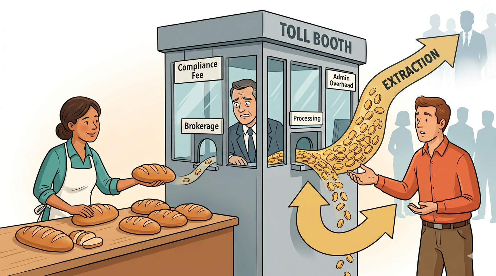
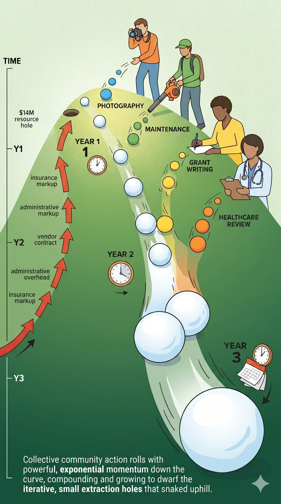

# The Virtuous Spiral: What If Costs Went Down?

> **Reviewed October 2026.** Written in spring 2026, during the school budget fight. Sources were re-checked and some wording corrected in October 2026.

*Distinguishing greed from genuine cost, and how every savings passed forward
creates the next one.*

---

We're conditioned to accept that costs always go up. Healthcare premiums
increase every year. Textbook prices rise every edition. Insurance, compliance,
administration - everything trends upward. We call it inflation and treat it
like weather: inevitable, impersonal, beyond anyone's control.

But not all cost increases are the same. Some are real. Some are extraction.
And the difference matters enormously - because only one of them is fixable
at the local level.

## Two Kinds of "Expensive"

### Natural cost (hard to avoid)

- Raw materials genuinely cost more (lumber prices, fuel prices)
- Skilled labor is scarce and people deserve fair pay
- Genuine quality improvements require investment (better medical technology,
  safer buses, more effective teaching methods)
- Regulatory compliance that addresses real safety or equity concerns

These are honest costs. They reflect real value or real scarcity. When lumber
prices rise because forests are depleted, that's a signal to use less lumber
or find alternatives. When a teacher's salary rises because we value education,
that's a community choice.

### Extraction cost (created by intermediaries)

- A college textbook whose price [rose 1,041% between 1977 and 2015](https://www.nbcnews.com/feature/freshman-year/college-textbook-prices-have-risen-812-percent-1978-n399926) by the BLS price index - over three times the rate of inflation
- An aspirin that costs pennies to make but
  [$25 in a hospital](https://www.healthcarefinancenews.com/medtech-blog/why-aspirin-taken-hospital-can-cost-upwards-25)
- A commission-paid insurance broker who [earns more when a district's premiums go up](https://jerseyvindicator.org/2026/01/28/new-jersey-school-district-missed-49-million-in-savings-by-skipping-state-health-plan-audit-finds/) (as a state audit found in Perth Amboy)
- A staffing agency that takes a substantial share of each worker's billing rate - part of it for payroll taxes and insurance, the rest as overhead and margin - while the worker themselves may struggle to make ends meet
- Administrative layers that exist to manage other administrative layers

These aren't real costs. They're tolls. Someone built a booth on the road
between "person who does the work" and "person who needs the work done" and
charges both sides for passage. Each toll was justified once ("quality
assurance," "risk management," "compliance"), but the toll has long since
exceeded the value of what it was supposed to protect.

## The Spiral Downward (the good kind)

Here's what makes extraction costs different from natural costs: **they can
be removed.** And when you remove one, something interesting happens.

### The chain reaction

Imagine the school district switches from a commercial insurance broker to a
direct arrangement with the state plan or a [reference-based pricing](https://www.shrm.org/topics-tools/news/benefits-compensation/reference-based-pricing-another-self-insured-option-employers) model
(paying hospitals a fixed multiple of Medicare rates - [for example 125% or 140%](https://hylant.com/insights/blog/reference-based-pricing-setting-price-limits-on-healthcare) - instead of the [roughly 250% that employers and private insurers paid on average in 2022](https://www.rand.org/news/press/2024/05/13.html)). Healthcare costs drop - maybe not 30% overnight,
but measurably.

That savings means:
1. **The district can retain staff** it was going to cut - those salaries
   stay in the local economy
2. **Teachers spend less on their own healthcare** contributions - they have
   more to spend locally
3. **The PTA needs to fundraise less** to cover the gap - volunteer energy
   goes to enrichment instead of survival
4. **Property values stabilize** because the school system isn't visibly
   collapsing - families stay, tax base holds

Each step feeds the next. The savings *compound* through the community.

Now imagine that same logic applied to multiple extraction points
simultaneously:
- [Community-run photography](02-open-image-project) replaces an outside photo vendor
- [Volunteer maintenance](03-community-maintenance) eliminates the contractor premium
- A [grant writing team](11-grant-writing) brings in external funding
- [Direct provider relationships](05-health-insurance) reduce healthcare overhead

Each one is modest on its own. Together, they shift the ratio of the pie
back toward the community. The virtuous spiral is the opposite of the
extraction creep described in [The Void](bigger-picture-void) - instead
of each intermediary adding cost, each removal passes savings forward.

### Snowballs, not silver bullets

It's easy to look at a $13.5 million deficit and dismiss community efforts as
too small to matter. A volunteer leaf-blowing brigade doesn't close a $13.5M
gap. A PTA photography fundraiser doesn't close it either. No single module
in this whitepaper does.

But that's not how compounding works.

Each small saving is a snowball. The tax levy increase
([Prong 1](bigger-picture-action#prong-1-right-now-tax-bridge--temporary-sacrifice))
buys time - it keeps the system alive while the snowballs start rolling.
Each community effort
([Prong 2](bigger-picture-action#prong-2-this-year-and-ongoing-community-gets-to-work))
is a snowball that frees up a bit of budget. Each structural cost removed
([Prong 3](bigger-picture-action#prong-3-multi-year-structural-changes-community-researches-district-executes))
is a snowball that rolls downhill and picks up mass.

A [grant writing](11-grant-writing) win brings in external funding. Some of
that offsets a position whose [healthcare costs](05-health-insurance) dropped
because the district switched to a better plan. Those healthcare savings help
justify a [solar PPA](09-energy-facilities) assessment. The solar PPA
produces annual energy savings. Those savings help retain a
[para](04-paraprofessional-audit) who was going to be cut. That para's
retention avoids a potential due-process dispute that could have cost far
more than the savings.

No single step is dramatic. But like compound interest, the gains accelerate
over time because each round starts from a higher base. The first year is
grinding. The second year is momentum. By the third year, the community
wonders why it ever accepted the old cost structure.

The $13.5M hole wasn't created in one year either. [Reported drivers](https://thedigestonline.com/news/west-orange-schools-budget-deficit-2026-layoffs/) include rising health benefit costs, the end of federal COVID relief, and state aid and levy caps that don't keep pace. My argument is that some share of the cost growth underneath is extraction - a bit more here for insurance, a bit more there for vendor contracts - and that this share is the part a community can push back on. The
spiral works in both directions. We just need to reverse the direction.

## How to Tell the Difference

When someone says "costs are going up," ask:

| Question | If the answer suggests... | It's probably... |
|----------|--------------------------|-----------------|
| Did the *work itself* get harder or more complex? | New medical procedures, harder curriculum standards | Natural cost |
| Did the *intermediary layer* grow? | New billing requirements, new compliance vendors, new middlemen | Extraction cost |
| Would a competitor charge less? | Yes, but switching costs are prohibitive | Lock-in (extraction) |
| Does the price drop dramatically when a patent expires or a contract ends? | Yes (like Lyrica: a brand list price of [about $7.50 a capsule, against about $0.20 for pharmacies buying the generic](https://www.46brooklyn.com/news/2019/7/23/lyrica-goes-generic) when it launched in 2019) | Much of the original price was pricing power, not production cost |
| Is the provider being paid fairly? | No - the worker gets a fraction of what's charged | The markup is going to intermediaries |

This isn't about declaring all costs illegitimate. Teachers deserve good pay.
Doctors deserve good pay. Quality materials cost what they cost. The target
is the *gap* between what the worker earns and what the consumer pays - the
extraction layer that benefits neither side.

## Applying This to the School District

The community exoskeleton from the whitepaper targets savings in different
ways - some remove extraction, some bring in new revenue, some replace paid
services with volunteer capacity:

| Module | Type of saving | How |
|--------|---------------|-----|
| [Bridge Grant](01-instructional-bridge) | Cost shift | PTA funds the same teachers directly - no new overhead |
| [Open Image Project](02-open-image-project) | Extraction removal | Cuts out a corporate vendor; revenue stays local |
| [Community Maintenance](03-community-maintenance) | Volunteer replacement | Neighbors replace a contractor - same work, no markup |
| [Health Insurance Review](05-health-insurance) | Extraction removal | Strips broker middlemen and plan overhead |
| [Grant Writing](11-grant-writing) | New revenue | Brings in external money the district wasn't pursuing |
| [Open Governance](06-open-governance) | Efficiency | Reduces the time cost of decision-making for everyone |

None of these cut teacher pay. None reduce educational quality. They each
reclaim resources for the community through a different mechanism - but the
effect compounds the same way.

---

Next: [Good Deflation and the House of Cards](bigger-picture-deflation)
