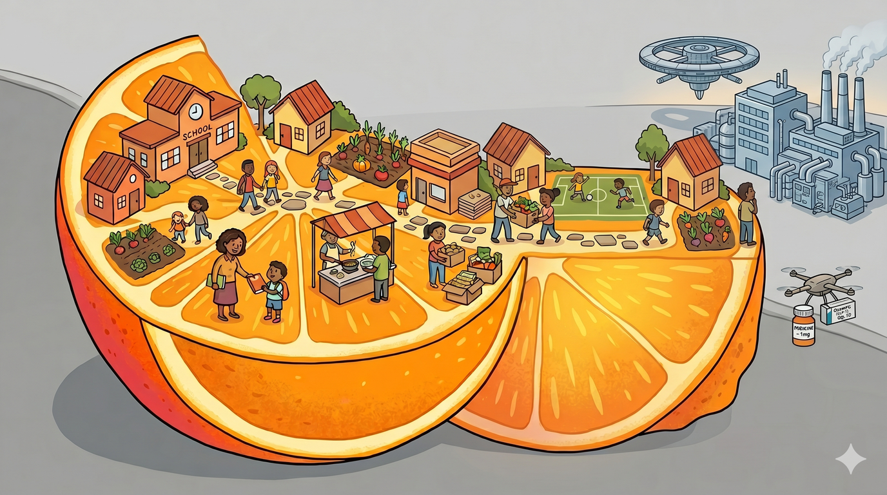

# The Limits of the Void

> **Reviewed October 2026.** Written in spring 2026, during the school budget fight. Sources were re-checked and some wording corrected in October 2026.

The thought experiment has a deliberate weakness, and it's worth being
honest about it rather than hand-waving past it. The "Void" works great
for things that are easier to produce at scale. Tylenol can be manufactured
in many places with the right regulated facilities — it's the same pill in
every building.

But what happens when the outside world invents something so complex, so
expensive, and so transformative that our little isolated town couldn't
possibly make it ourselves? GLP-1 medications (Ozempic, Wegovy, Mounjaro)
require advanced biotech manufacturing, global supply chains, and billions
in R&D. No amount of intermediary-stripping changes that. For complex
production, **we must trade with the outside.**

And sometimes what the outside produces is so transformative and expensive that the price
of that trade threatens to break the system.

## The thought experiment

Let's push the sci-fi thought experiment one step further.

Imagine someone in the outside world invents a pill that grants biological
immortality. It works.
But it costs $100,000 per year per person. You cannot give it to everyone.

How do you allocate it fairly?

Take a moment with this. There is no comfortable answer:
- **Give it to everyone** - the system goes bankrupt and chaos erupts.
- **Give it to nobody** - the pill exists, people know it works, and they
  watch others age and die while a solution sits on a shelf. The rage alone
  would tear society apart.
- **Give it to whoever can pay** - the wealthy live forever, everyone else
  doesn't. There are dystopian movies about this.
- **Ration by merit** - who decides merit? Politicians? Doctors? An
  algorithm? Every answer is monstrous in its own way.
- **Lottery** - random, which might feel fair to some, yet also absurd and a rather inefficient distribution.

There is no option where everyone is happy. Every path creates grief,
anger, or injustice. The only honest response is: **acknowledge the
impossible trade-off, be transparent about it, and choose the least bad
option while working to make the drug cheaper so the trade-off eases
over time.**

## This is happening right now

GLP-1 medications are a less extreme version of the immortality pill. They
are genuinely transformative - for people with severe obesity, type 2
diabetes, and cardiovascular risk, they are life-changing and potentially
life-saving. They [list at around $1,000/month per person](https://www.webmd.com/obesity/mounjaro-ozempic-wegovy-zepbound-difference), though Novo Nordisk [cut its direct cash price](https://www.cnbc.com/2025/11/17/novo-nordisk-cash-prices-wegovy-ozempic.html) for Wegovy and Ozempic to $349/month in November 2025. They're being
prescribed at scale - for medical necessity AND for cosmetic weight loss.

And employers are
[struggling to absorb it](https://www.healthsystemtracker.org/brief/perspectives-from-employers-on-the-costs-and-issues-associated-with-covering-glp-1-agonists-for-weight-loss/), according to those interviewed for a KFF brief; one HR director there described a roughly 30% rise in GLP-1 costs.
GLP-1s are now the
[top drug by spend](https://www.nj.gov/treasury/news/2025/07092025.shtml)
in the NJ state health plans - Wegovy alone is the single highest-cost drug
across all three state programs.
Four state Medicaid programs have [dropped GLP-1 coverage for weight loss](https://www.kff.org/medicaid/medicaid-coverage-of-and-spending-on-glp-1s/), while keeping it for diabetes.
Prescription drug costs, including high-cost GLP-1s, are among the main drivers the state's actuary named behind double-digit premium increases - including the [29.7% increase recommended for the SEHBP](https://www.nj.gov/treasury/news/2025/07092025.shtml).
Our own district faces a ~18% health-benefits increase; I don't know how much of that is GLP-1 spending.

## The uncomfortable choices

The same impossible menu from the immortality pill applies:

- **Cover everyone who wants it** - premiums spike, the insurance pool strains, and health costs crowd out other spending - including staff. Rising health costs were part of this year's budget squeeze.
- **Cover nobody** - people with genuine medical need suffer. Diabetes
  progresses. Cardiovascular risk goes unmanaged. There's
  [some evidence](https://aon.mediaroom.com/2026-01-13-Aons-Latest-GLP-1-Research-Reveals-Long-Term-Employer-Cost-Savings-and-Significant-Reductions-in-Cancer-Risk-for-Women)
  that long-term, consistent GLP-1 use slows medical cost growth and cuts cardiovascular hospitalizations, but
  [other research](https://sanford.duke.edu/story/new-research-glp-1-drugs-deliver-real-health-gains-not-short-term-cost-savings/)
  finds no short-term cost offset. The savings may come eventually, but
  people need the drug now.
- **Cover only medical necessity** - this is where most systems are heading,
  but "medical necessity" is a line drawn by humans, and every person on the
  wrong side of it will feel the decision is unfair. A person with a BMI of
  39 qualifies; a person with a BMI of 29 who is pre-diabetic doesn't. The
  line saves the pool but it doesn't feel just.
- **Drop coverage and let people pay out-of-pocket** - those who can afford
  it get the drug, those who can't don't. We're back to the caste system.

People will be unhappy no matter what. That's not a failure of the system -
it's the nature of the problem. The drug is too good and too expensive for
universal access *right now*.

## The flatten-the-curve version

The only path that doesn't end in despair is the same one we're proposing
for the school budget: **buy time while the underlying economics change.**

GLP-1s are likely to keep getting cheaper. Patents expire. Generics enter. Manufacturing
scales. The Lyrica example in [The Void](bigger-picture-void) - $8 per capsule to
under $0.25 once generics arrived - shows how dramatic the drop can be.
But it takes years.

In the meantime:
- **Transparent triage** - honest, public criteria for who gets coverage,
  reviewed by the community, not hidden in an insurance company's
  prior-authorization algorithm
- **Cost containment** - negotiate as a community or consortium rather than
  accepting list prices; explore international pricing where legal
- **Parallel investment in prevention** - DPC, community health programs,
  nutrition access - not as a replacement for the drug but to reduce the
  number of people who reach the point of needing it
- **Accept the unhappiness** - some people who want the drug won't get it
  covered. That's painful. Being honest about it is better than pretending
  the pool can absorb unlimited demand, because that path ends with the
  pool collapsing and *nobody* getting covered

This is the hardest version of the community coordination problem. It's
easier to organize a leaf blower brigade than to tell your neighbor their
prescription won't be covered. But it's the same underlying question: how
does a community allocate limited resources fairly, transparently, and with
enough solidarity that people accept outcomes they don't like?

The time-economy strips away the billing systems and chargemasters. It
doesn't strip away the scarcity. Some things are genuinely hard, and the
honest response is to face them rather than pretend they'll resolve
themselves.

---

Back to: [The Void](bigger-picture-void) | Next: [The Virtuous Spiral](bigger-picture-spiral)
