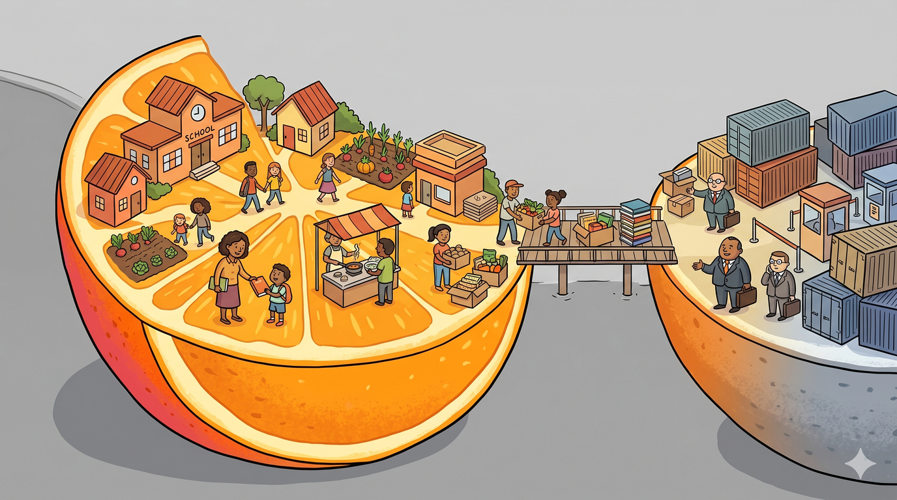
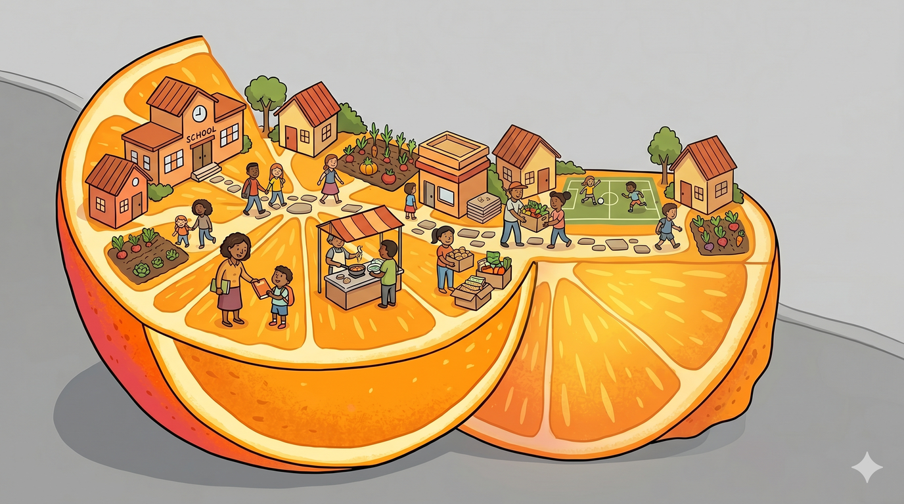
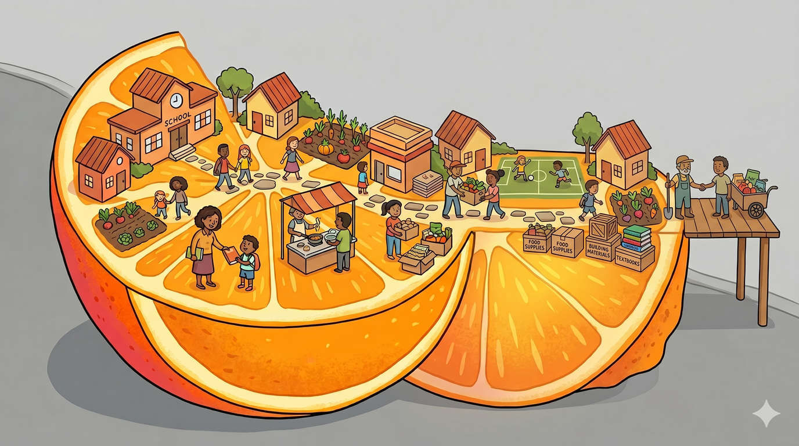
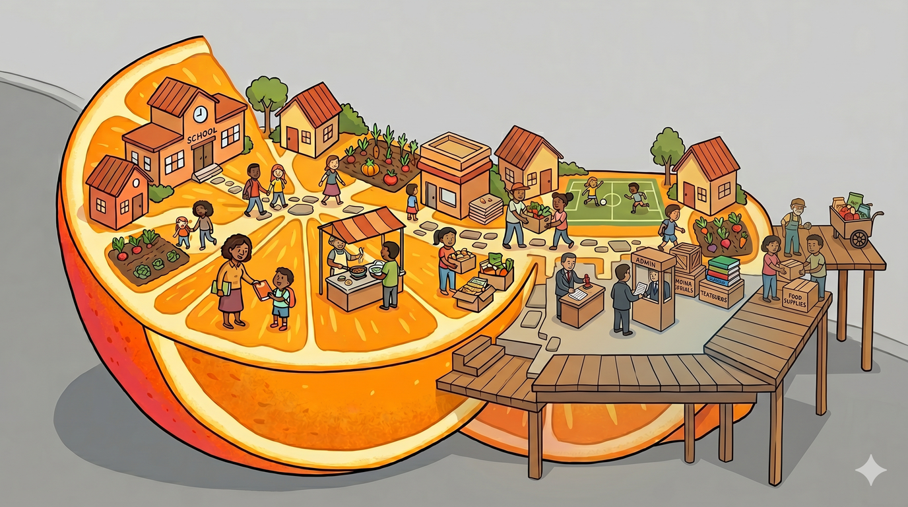
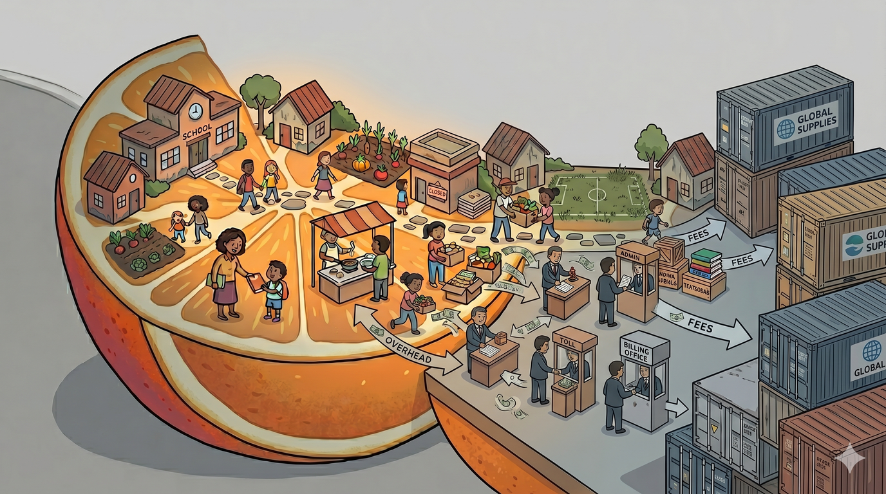

# The Void: A Time-Economy Thought Experiment

*What if we stripped everything away and asked what things actually cost?*

---

Imagine an absurd hypothetical where only West Orange exists. Everything
outside has been dematerialized, but the world still magically works. Money
is also not a thing. We trade in time.

Let's see what it takes to run a school district from first principles.

## Setting the Stage

**Shelter:** West Orange still exists, so we have that. There's a bit of a
Marvel-style Snap/Blip situation since not everybody who works here lives
here and vice versa, but let's imagine it works out.

**Food:** We probably don't have enough farms to feed everyone. Maybe with
enough creativity and vertical farming... but let's just re-materialize
enough of the outside world to trade with. We provide some remote services;
they send food. First exchange established.

**Power:** We have solar panels and batteries - that counts for something.
We'll trade for the rest.

The basics are covered. Now let's build a school district.

## What Does a School Actually Need?

**Textbooks.** In the time-economy, a knowledgeable professional writes one,
someone prints it, kids read it. That's a finite investment of skilled time.

In the real economy, textbook prices have risen
[1,041% from 1977 to 2015](https://www.nbcnews.com/feature/freshman-year/college-textbook-prices-have-risen-812-percent-1978-n399926) -
three times the rate of inflation. Each new "edition"
[adds 12% to the price, and publishers keep 65% of what's paid](https://educationdata.org/average-cost-of-college-textbooks).
Who introduced a 1,000% markup into "person writes, person reads"?

**Teachers.** Teachers must be easy, right? You feed them, clothe them, get them
some textbooks. Maybe some crayons. In the time-economy, teaching is a direct
exchange: a skilled person gives time to children. How much can that really cost?

Well - it is a bit more complicated when you look deeper. Like healthcare!
Teachers get booboos too. That can't be very expensive to fix in the time-economy.
How many teachers can one doctor patch up on average?

**Healthcare.** Yeah, this is where it gets complicated. Cancer is no joke,
even if this thought experiment reads a bit humorously. A local doctor could
handle the basics. Most supplies are straightforward - scissors are just
scissors, right?

Who would add absurd markups just to tag something as "medical grade"?

### The Markup Gallery

> **Saline bags** - literally salt water - cost about
> [$1 to manufacture](https://www.advisory.com/daily-briefing/2013/08/27/the-secret-of-salines-cost-why-a-1-bag-can-cost-700).
> Hospitals have charged $546 for six liters. Some have published prices as
> high as [$26,667 for a single bag](https://www.goodbill.com/hospital-price-of-saline).

> **Tylenol** - the purest example of the pattern. The acetaminophen tablet
> a nurse hands you in a hospital is the *exact same pill* you buy at CVS.
> Same manufacturer, same dosage, same molecule. Hospitals charge
> [$15-25 per individual pill](https://www.beckershospitalreview.com/supply-chain/10-immensely-overinflated-hospital-costs/) -
> you can buy whole bottles of various sizes for less than $10. The product didn't change.
> The building did.

> **EpiPens** cost about
> [$30 to manufacture](https://www.nbcnews.com/business/consumer/industry-insiders-estimate-epipen-costs-no-more-30-n642091)
> including the drug, the injector, R&D, and royalties. The retail price
> [rose to over $600](https://www.cnbc.com/2016/08/25/epipens-cost-just-several-dollars-to-make-customers-pay-more-than-600-dollars-for-them.html).
> The epinephrine itself costs about $1.

> **Needles** - Humana charged patients
> [$143.25 for needles it bought for 80 cents](https://www.newsweek.com/why-hospitals-mark-prices-1000-percent-343006).
> That's a 17,806% markup.

> **Brand-name drugs vs. generics** - when Lyrica's patent expired in 2019,
> [nine generic competitors entered the market](https://xtalks.com/lyrica-patent-expiration-ushers-in-9-generic-competitors-1998/)
> and the price collapsed. Branded Lyrica cost roughly $8 per capsule;
> generic pregabalin is now
> [under $0.25](https://www.goodrx.com/pregabalin).
> Same molecule, same dosage, same effect. A 97% price drop because a
> patent expired - not because the drug got cheaper to make.

In the time-economy: a doctor examines a patient, administers salt water,
and gives them a common pain reliever. That's an hour of skilled work and
some basic supplies. In the real economy, the same encounter generates
thousands of dollars flowing to manufacturers, distributors, insurers,
billing companies, and hospital systems - each adding a layer of cost that
has nothing to do with the actual healing.

If someone did this with food we'd call it price gouging. In healthcare we
call it the chargemaster.

## Everything Else the School Needs

**Transportation.** Kids need to get to school. A bus
is a bus. In the time-economy, someone drives it for a few hours each day.
In the real economy, transportation is one of the larger line items in a
school budget - involving vendor contracts, fuel costs that fluctuate with
global oil markets, procurement processes for the vehicles themselves, and
layers of insurance and compliance. In the time-economy, your neighbor drives your
kid to school. In the real economy, a multinational fuel market and a
procurement chain stand between your child and the building down the road.

**Building maintenance.** A school needs a new roof. In the time-economy:
some skilled tradespeople spend a few weeks, the community supplies
materials. In the real economy: a bidding process, contractor markups,
insurance requirements, bonding requirements, prevailing wage laws,
inspections, and by the time it's done the roof cost 5x what the materials
and labor actually required. Each layer existed to solve a real problem
once, but collectively they've become the problem.

**The cafeteria.** Kids need lunch. In the time-economy, some parents cook,
others grow food, someone coordinates. In the real economy: a food service
contract with Aramark or Sodexo, processed food shipped from industrial
facilities, USDA compliance paperwork, and somehow a school lunch costs
more than the ingredients of a home-cooked meal while being nutritionally
worse. The overhead IS the product.

**Technology.** Kids need computers. In the time-economy, the community's
engineers set up and maintain devices. In the real economy: a Chromebook
purchasing contract, a Google Workspace licensing agreement, an IT services
contract, a content filtering vendor, a student information system vendor,
more overlapping communication apps than you can shake a stick at,
and a cybersecurity audit firm. The child types on the same keyboard
either way.

## The Pattern

The activity hasn't changed. Teaching is still teaching. Feeding is still
feeding. Healing is still healing. Driving is still driving.

What changed is the number of intermediaries extracting value from each
transaction.

In the time-economy, you strip those away and suddenly the math works
again - because the actual work was never the expensive part.

## How Greed Creeps In

Our hypothetical West Orange starts clean. Direct exchanges, no overhead
beyond the time spent moving things around. But watch what happens over time:

**Stage 1 - Reasonable structure.** Someone organizes the textbook printing
and takes a small share for their time. Fair - coordination is real work.
Someone else handles food distribution and keeps a margin for logistics.
Also fair. A small slice of the pie flows to overhead, but it's proportional
to the value added.

**Stage 2 - Consolidation.** The textbook organizer realizes they're the only
game in town. Prices creep up. Not dramatically - just a bit each year. The
food distributor merges with two others. "Efficiencies of scale," they say.
Prices don't drop. The overhead slice grows.

**Stage 3 - Lock-in.** The textbook provider bundles online resources with the
books. Teachers can't switch without losing their lesson plans. The food
provider signs a multi-year exclusive contract. The healthcare provider
requires a specific billing system that only works with their network.
Each intermediary has built a moat.

**Stage 4 - Extraction.** The intermediaries are now extracting more value
than the original workers. The textbook publisher makes more per book than
the author. The insurance company makes more per patient than the doctor.
The staffing agency makes more per hour than the paraprofessional. The pie
hasn't grown, but the extraction slice has consumed most of it.

This is the journey from the Past pie to the Present pie in [The Shrinking
Slice](bigger-picture-shrinking-slice). It happened gradually, through
individually reasonable steps, each of which created a layer of cost that
now can't easily be removed.

The time-economy thought experiment reveals the gap between what things
*cost* and what we *pay*. The next question is: can we close that gap?

## The Limits of the Void (The Sci-Fi Problem)

The thought experiment has a deliberate weakness, and it's worth being
honest about it rather than hand-waving past it. The "Void" works great
for things that are easy to produce locally. Tylenol can be made anywhere -
it's the same pill in every building. 

But what happens when the outside world invents something so complex, so
expensive, and so transformative that our little isolated town couldn't
possibly make it ourselves? GLP-1 medications (Ozempic, Wegovy, Mounjaro)
require advanced biotech manufacturing, global supply chains, and billions
in R&D. No amount of intermediary-stripping changes that. For complex
production, **we must trade with the outside.**

And sometimes what the outside produces is so transformative and expensive that the price
of that trade threatens to break the system.

### The thought experiment

Let's push the sci-fi thought experiment one step further.

Imagine someone in the outside world invents a pill that grants biological
immortality. It works.
But it costs $100,000 per year per person. You cannot give it to everyone.

How do you allocate it fairly?

Take a moment with this. There is no comfortable answer:
- **Give it to everyone** - the system goes bankrupt and chaos erupts.
- **Give it to nobody** - the pill exists, people know it works, and they
  watch others age and die while a solution sits on a shelf. The rage alone
  would tear society apart.
- **Give it to whoever can pay** - the wealthy live forever, everyone else
  doesn't. There are dystopian movies about this.
- **Ration by merit** - who decides merit? Politicians? Doctors? An
  algorithm? Every answer is monstrous in its own way.
- **Lottery** - random, which might feel fair to some, yet also absurd and a rather inefficient distribution.

There is no option where everyone is happy. Every path creates grief,
anger, or injustice. The only honest response is: **acknowledge the
impossible trade-off, be transparent about it, and choose the least bad
option while working to make the drug cheaper so the trade-off eases
over time.**

### This is happening right now

GLP-1 medications are a less extreme version of the immortality pill. They
are genuinely transformative - for people with severe obesity, type 2
diabetes, and cardiovascular risk, they are life-changing and potentially
life-saving. They cost $1,000-1,300/month per person. They're being
prescribed at scale - for medical necessity AND for cosmetic weight loss.

And the insurance system
[can't absorb it](https://www.healthsystemtracker.org/brief/perspectives-from-employers-on-the-costs-and-issues-associated-with-covering-glp-1-agonists-for-weight-loss/).
GLP-1s are now the
[top drug by spend](https://www.nj.gov/treasury/news/2025/07092025.shtml)
in the NJ state health plans - Wegovy alone is the single highest-cost drug
across all three state programs. Employers report ~30% increases in GLP-1
costs. Multiple insurers are
[dropping coverage entirely](https://glp-1.com/article/glp-1s-insurance-cover-in-2026).
This single drug category is a major driver of double-digit premium
increases across the state - including the
[29.7% increase recommended for the SEHBP](https://www.nj.gov/treasury/news/2025/07092025.shtml)
and the ~18% increase our own district is facing.

### The uncomfortable choices

The same impossible menu from the immortality pill applies:

- **Cover everyone who wants it** - premiums spike, the insurance pool
  breaks, teachers lose their jobs because the health plan can't be funded.
  That's literally what's happening right now.
- **Cover nobody** - people with genuine medical need suffer. Diabetes
  progresses. Cardiovascular risk goes unmanaged. There's
  [some evidence](https://aon.mediaroom.com/2026-01-13-Aons-Latest-GLP-1-Research-Reveals-Long-Term-Employer-Cost-Savings-and-Significant-Reductions-in-Cancer-Risk-for-Women)
  that long-term GLP-1 use reduces hospitalization costs, but
  [other research](https://sanford.duke.edu/story/new-research-glp-1-drugs-deliver-real-health-gains-not-short-term-cost-savings/)
  finds no short-term cost offset. The savings may come eventually, but
  people need the drug now.
- **Cover only medical necessity** - this is where most systems are heading,
  but "medical necessity" is a line drawn by humans, and every person on the
  wrong side of it will feel the decision is unfair. A person with a BMI of
  39 qualifies; a person with a BMI of 29 who is pre-diabetic doesn't. The
  line saves the pool but it doesn't feel just.
- **Drop coverage and let people pay out-of-pocket** - those who can afford
  it get the drug, those who can't don't. We're back to the caste system.

People will be unhappy no matter what. That's not a failure of the system -
it's the nature of the problem. The drug is too good and too expensive for
universal access *right now*.

### The flatten-the-curve version

The only path that doesn't end in despair is the same one we're proposing
for the school budget: **buy time while the underlying economics change.**

GLP-1s will get cheaper. Patents expire. Generics enter. Manufacturing
scales. The Lyrica example from earlier in this page - $8 per capsule to
under $0.25 once generics arrived - shows how dramatic the drop can be.
But it takes years.

In the meantime:
- **Transparent triage** - honest, public criteria for who gets coverage,
  reviewed by the community, not hidden in an insurance company's
  prior-authorization algorithm
- **Cost containment** - negotiate as a community or consortium rather than
  accepting list prices; explore international pricing where legal
- **Parallel investment in prevention** - DPC, community health programs,
  nutrition access - not as a replacement for the drug but to reduce the
  number of people who reach the point of needing it
- **Accept the unhappiness** - some people who want the drug won't get it
  covered. That's painful. Being honest about it is better than pretending
  the pool can absorb unlimited demand, because that path ends with the
  pool collapsing and *nobody* getting covered

This is the hardest version of the community coordination problem. It's
easier to organize a leaf blower brigade than to tell your neighbor their
prescription won't be covered. But it's the same underlying question: how
does a community allocate limited resources fairly, transparently, and with
enough solidarity that people accept outcomes they don't like?

The time-economy strips away the billing systems and chargemasters. It
doesn't strip away the scarcity. Some things are genuinely hard, and the
honest response is to face them rather than pretend they'll resolve
themselves.

---

Next: [The Virtuous Spiral](bigger-picture-spiral)
