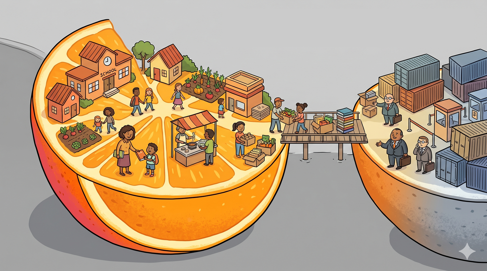
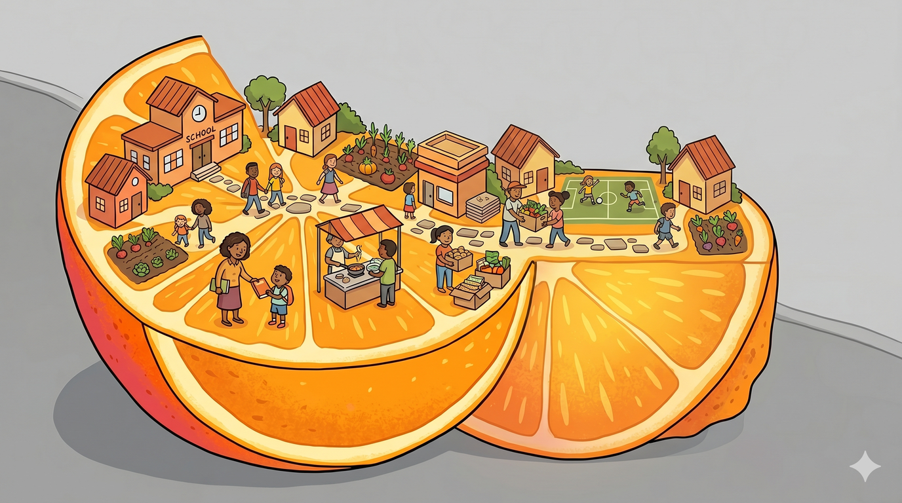
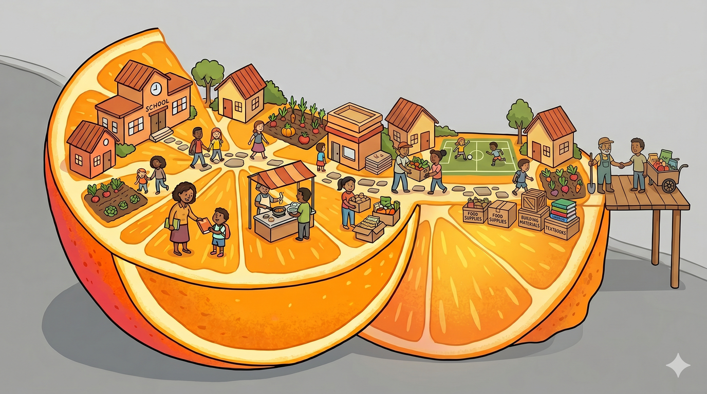
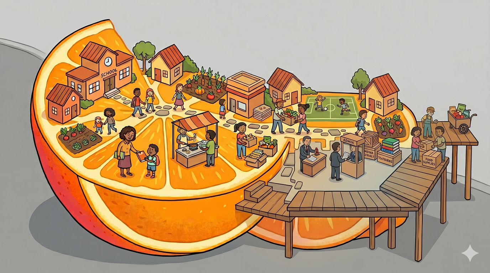
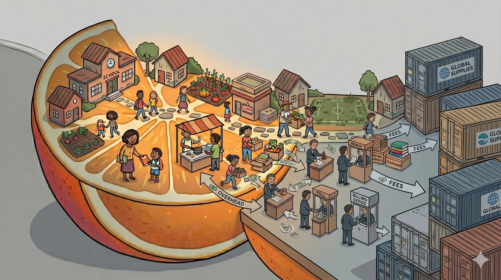

# The Void: A Time-Economy Thought Experiment

> **Reviewed October 2026.** Written in spring 2026, during the school budget fight. Sources were re-checked and some wording corrected in October 2026.

*What if we stripped everything away and asked what things actually cost?*

---

Imagine an absurd hypothetical where only West Orange exists. Everything
outside has been dematerialized, but the world still magically works. Money
is also not a thing. We trade in time.

Let's see what it takes to run a school district from first principles.

## Setting the Stage

**Shelter:** West Orange still exists, so we have that. There's a bit of a
Marvel-style Snap/Blip situation since not everybody who works here lives
here and vice versa, but let's imagine it works out.

**Food:** We probably don't have enough farms to feed everyone. Maybe with
enough creativity and vertical farming... but let's just re-materialize
enough of the outside world to trade with. We provide some remote services;
they send food. First exchange established.

**Power:** We have solar panels and batteries - that counts for something.
We'll trade for the rest.

The basics are covered. Now let's build a school district.

## What Does a School Actually Need?

**Textbooks.** In the time-economy, a knowledgeable professional writes one,
someone prints it, kids read it. That's a finite investment of skilled time.

In the real economy, college textbook prices have risen
[1,041% from 1977 to 2015](https://www.nbcnews.com/feature/freshman-year/college-textbook-prices-have-risen-812-percent-1978-n399926) -
three times the rate of inflation.
Many publishers release [new editions year after year that change very little](https://educationdata.org/average-cost-of-college-textbooks), and three publishers control over 80% of the college textbook market.
Who turned "person writes, person reads" into a price that outran inflation threefold?

**Teachers.** Teachers must be easy, right? You feed them, clothe them, get them
some textbooks. Maybe some crayons. In the time-economy, teaching is a direct
exchange: a skilled person gives time to children. How much can that really cost?

Well - it is a bit more complicated when you look deeper. Like healthcare!
Teachers get booboos too. That can't be very expensive to fix in the time-economy.
How many teachers can one doctor patch up on average?

**Healthcare.** Yeah, this is where it gets complicated. Cancer is no joke,
even if this thought experiment reads a bit humorously. A local doctor could
handle the basics. Most supplies are straightforward - scissors are just
scissors, right?

Who would add absurd markups just to tag something as "medical grade"?

### The Markup Gallery

> **Saline bags** - literally salt water - cost about
> [$1 to manufacture](https://www.advisory.com/daily-briefing/2013/08/27/the-secret-of-salines-cost-why-a-1-bag-can-cost-700).
> Hospitals have charged $546 for six liters. Some have published prices as
> high as [$26,667 for a single bag](https://www.goodbill.com/hospital-price-of-saline).

> **Tylenol** - the purest example of the pattern. The acetaminophen tablet
> a nurse hands you in a hospital is the same drug you buy at CVS.
> Same dosage, same molecule. Some hospitals have charged
> [$15 or more per individual pill](https://www.beckershospitalreview.com/supply-chain/10-immensely-overinflated-hospital-costs/) -
> you can buy whole bottles of various sizes for less than $10. The product didn't change.
> The building did.

> **EpiPens** cost an estimated
> [$30 or less each to make](https://www.nbcnews.com/business/consumer/industry-insiders-estimate-epipen-costs-no-more-30-n642091),
> including the drug, the injector, and licensing fees. A two-pack's retail price
> [rose to over $600](https://www.cnbc.com/2016/08/25/epipens-cost-just-several-dollars-to-make-customers-pay-more-than-600-dollars-for-them.html).
> The epinephrine itself costs about $1.

> **Needles** - a 1991 ABC investigation found Humana's hospitals (since sold off) [charged patients $143.25 for needles bought for 80 cents](https://www.newsweek.com/why-hospitals-mark-prices-1000-percent-343006) - a 17,806% markup.

> **Brand-name drugs vs. generics** - when Lyrica's patent expired in 2019,
> [nine generic competitors entered the market](https://xtalks.com/lyrica-patent-expiration-ushers-in-9-generic-competitors-1998/)
> and the price collapsed. Branded Lyrica cost roughly $8 per capsule;
> generic pregabalin is now
> [under $0.25](https://www.goodrx.com/pregabalin).
> Same molecule, same dosage, same effect. A 97% price drop because a
> patent expired - not because the drug got cheaper to make.

In the time-economy: a doctor examines a patient, administers salt water,
and gives them a common pain reliever. That's an hour of skilled work and
some basic supplies. In the real economy, the same encounter generates
thousands of dollars flowing to manufacturers, distributors, insurers,
billing companies, and hospital systems - each adding a layer of cost that
has nothing to do with the actual healing.

If someone did this with food we'd call it price gouging. In healthcare we
call it the chargemaster.

## Everything Else the School Needs

**Transportation.** Kids need to get to school. A bus
is a bus. In the time-economy, someone drives it for a few hours each day.
In the real economy, transportation is one of the larger line items in a
school budget - involving vendor contracts, fuel costs that fluctuate with
global oil markets, procurement processes for the vehicles themselves, and
layers of insurance and compliance. In the time-economy, your neighbor drives your
kid to school. In the real economy, a multinational fuel market and a
procurement chain stand between your child and the building down the road.

**Building maintenance.** A school needs a new roof. In the time-economy:
some skilled tradespeople spend a few weeks, the community supplies
materials. In the real economy: a bidding process, contractor markups,
insurance requirements, bonding requirements, prevailing wage laws,
inspections, and by the time it's done the roof can cost several times what the materials
and labor alone would. Each layer existed to solve a real problem
once, but collectively they've become the problem.

**The cafeteria.** Kids need lunch. In the time-economy, some parents cook,
others grow food, someone coordinates.
In the real economy: a food service management contract, food shipped from industrial facilities, USDA compliance paperwork, and a stack of overhead between the ingredients and the tray.
To me, the overhead starts to look like the product.

**Technology.** Kids need computers. In the time-economy, the community's
engineers set up and maintain devices. In the real economy: a Chromebook
purchasing contract, a Google Workspace licensing agreement, an IT services
contract, a content filtering vendor, a student information system vendor,
more overlapping communication apps than you can shake a stick at,
and a cybersecurity audit firm. The child types on the same keyboard
either way.

## The Pattern

The activity hasn't changed. Teaching is still teaching. Feeding is still
feeding. Healing is still healing. Driving is still driving.

What changed is the number of intermediaries extracting value from each
transaction.

In the time-economy, you strip those away and suddenly the math works
again - because the actual work was never the expensive part.

## How Greed Creeps In

Our hypothetical West Orange starts clean. Direct exchanges, no overhead
beyond the time spent moving things around. But watch what happens over time:

**Stage 1 - Reasonable structure.** Someone organizes the textbook printing
and takes a small share for their time. Fair - coordination is real work.
Someone else handles food distribution and keeps a margin for logistics.
Also fair. A small slice of the pie flows to overhead, but it's proportional
to the value added.

**Stage 2 - Consolidation.** The textbook organizer realizes they're the only
game in town. Prices creep up. Not dramatically - just a bit each year. The
food distributor merges with two others. "Efficiencies of scale," they say.
Prices don't drop. The overhead slice grows.

**Stage 3 - Lock-in.** The textbook provider bundles online resources with the
books. Teachers can't switch without losing their lesson plans. The food
provider signs a multi-year exclusive contract. The healthcare provider
requires a specific billing system that only works with their network.
Each intermediary has built a moat.

**Stage 4 - Extraction.** In the thought experiment's endgame, the intermediaries can end up taking more than the original workers: the textbook publisher more per book than the author, the insurance company more per patient than the doctor, the staffing agency more per hour than the paraprofessional.
The pie hasn't grown, but the extraction slice has consumed most of it.

This is my rough picture of the journey from the Past pie to the Present pie in [The Shrinking
Slice](bigger-picture-shrinking-slice). It happened gradually, through
individually reasonable steps, each of which created a layer of cost that
now can't easily be removed.

The time-economy thought experiment reveals the gap between what things
*cost* and what we *pay*. The next question is: can we close that gap?

*(For readers curious where this kind of thinking comes from — it's a
well-developed tradition in economics and philosophy, with names from
Adam Smith to Ivan Illich to Elinor Ostrom. See the
[Time Economy deeper-dive appendix](appendix-time-economy) for the
academic lineage and a few lenses that map surprisingly cleanly onto
the school budget conversation.)*

---

Next: [The Limits of the Void](bigger-picture-void-limits)
