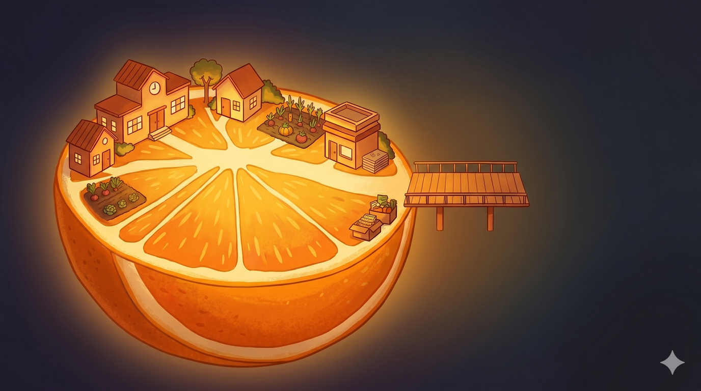

# The Bigger Picture

> **Reviewed October 2026.** Written in spring 2026, during the school budget fight. Sources were re-checked and some wording corrected in October 2026.

The whitepaper modules propose specific things the community can do right now.
These pages step back and ask: why is this happening, and what would it take
to actually fix the underlying problem - not just for our school district, but
for communities everywhere facing the same squeeze?

These sections include thought experiments - ways of seeing the crisis that might open up paths we haven't considered. The action plan at the end is the one we took into the spring 2026 budget fight, kept as a record.

1. [**The Shrinking Slice**](bigger-picture-shrinking-slice) - Where is our
   money actually going? A visualization of how the community's share of its
   own economic activity has eroded over time.

2. [**The Void**](bigger-picture-void) - What if we stripped everything away
   and rebuilt from first principles? A thought experiment about what things
   actually cost in time versus what we pay in dollars, and how extraction creeps in.

3. [**The Limits of the Void**](bigger-picture-void-limits) - Where the thought experiment breaks down: things too complex to make locally, the immortality-pill problem, and GLP-1 drugs as the version happening right now.

4. [**The Virtuous Spiral**](bigger-picture-spiral) - What if costs went
   *down* instead of always up? How to distinguish greed from genuine cost,
   and how every savings passed forward creates more.

5. [**Good Deflation and the House of Cards**](bigger-picture-deflation) - Why falling costs are not the Great Depression, and why an economy built ever higher on the same ground gets more fragile.

6. [**The Tooling Multiplier and the Time Dividend**](bigger-picture-tooling) - What better tools give back: less toil, less coordination overhead, and time returned to the community.

7. [**The Action Plan**](bigger-picture-action) - The three-prong plan from the spring 2026 budget fight: fix the right now, fix the process, fix the economics. That fight was lost on May 4, 2026; the plan is kept as a record and as a starting point for the next cycle.
