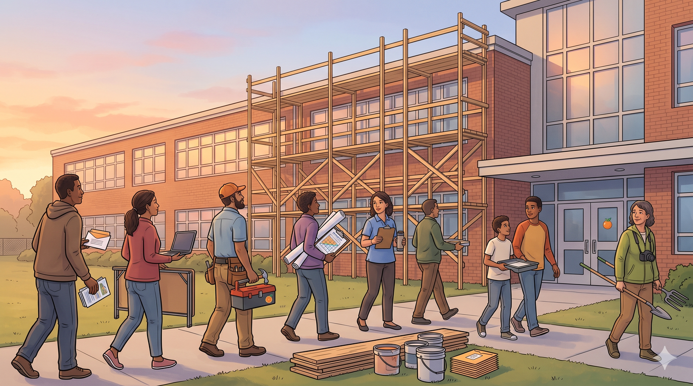

# The Next Year

*The May 4 budget vote is final. The cuts are real. Paraprofessionals
are being outsourced, positions are being eliminated or reassigned,
and real harm will land on real kids in September. This page is about what
the community can build between now and then plus over the next year,
so we're not sitting in the same room, in the same shape, in May 2027.*

---

## What we lost, and what we're not pretending

The April 20 and May 4 meetings between them stuck with the 2.5% tax
increase using the health-care exception (+ ~$750K) from the 2% cap, 
and a budget unchanged from the cuts the board had planned. The
referendum option was discussed but not pursued. The union/board
standoff continued. The room had real engagement near the end of the
May 4 meeting — the kind that suggests there's appetite for
something different — but no structural way to channel it.

A thousand passionate people saying the same true things into the
same hours-long format will keep producing the same outcome. That's
not a complaint about anyone in the room. It's the format itself.

## Why a platform, not a petition drive

Recent communication initiatives have often involved the common approach
of having many parents write letters to the board, email the
superintendent, and so on, including the use of templates and encouraging
mass-emails even with the same content. 

Similar to cramming more people into larger and larger meetings, in the
opinion of this site, that is not an effective approach. It is largely noise
around a few valid but non-controversial points like how everybody loves paras.

It has its place, but could be better channeled. **individual repetition 
isn't aggregation, and we just spent hours watching that not get anywhere** 
at the recent BoE meetings. Additional valid points are being starved of oxygen.

A recent [WOPE survey](https://woparents.org/budget-survey) went some distance in this direction, asking
the responder to pick between difficult choices. However, the output 
was again just another email template. We need something more.

What smarter aggregation actually looks like:

- **Ranked, forced choices** — not "everyone agrees everything is
  important" but "given A vs. B, here's where the community lands."
- **Counter-offers and alternatives** — not just *what we're against*
  but *what we'd accept instead*, including resources we'd pledge.
- **Offered time and funds** — "I'd contribute $X/month to keep this
  position" or "I'd volunteer 4 hours/week for this need" attached to
  the position itself.
- **Endorsement over re-posting** — when you agree, you raise the
  weight of an existing comment instead of adding a 201st identical
  one.

That's the design we're building toward. The first concrete piece
ships in weeks, not years.

## The Pilot: Parent Advocacy Site

The first piece of platform we'll have running is a structured
input-and-aggregation site for one school's worth of advocates,
piloted at Mount Pleasant Elementary almost immediately, with
the working-version POC ready to demonstrate at the next PTA
meeting on May 13th then used for real at the next BoE meeting on June 15.

### How it works

- The PTA prints a URL and unique codes, sealed in envelopes (one
  per child), and the school distributes them to teachers who place them into
  backpacks — same channel as the  printed school calendars that already go 
  home in every backpack.
  - This is likely to be just under 400 students at MPE. Doable.
- The principal sends a brief email blast legitimizing the program
  so families know the site is real.
- A code-holder visits the site and **without creating any account**
  can: rank a small set of current proposals, endorse existing
  comments, propose alternative phrasings, and offer pledges of time
  or funds attached to specific outcomes.
  - This could be comparable to the WOPE survey, with some expansion, 
  and must be mobile friendly.
- No personally identifying information is collected. The most a
  participant can self-identify as is **"advocate for an Nth-grader."**
- At no point can anybody map a person to a code, not even the site owner.

### What makes the design different

- **Anonymous but verified.** Each code came from a real backpack.
  No bots, no sock-puppets, no mass account creation.
- **Fixed vote budget per code.** You can't endlessly increase your
  weight by re-using the code; making a new choice replaces an
  earlier one.
- **Forced prioritization.** "Pick A or B" choices, not "rate every
  option 5/5."
- **Endorsement is the default action.** New comments require
  reviewing similar existing ones first; if any of them already say
  what you wanted to say, you boost it instead of re-saying it.
- **Pledges attach to positions.** "I'd give $20/month or 2 hours of
  volunteering to keep position X" is structured data, not buried in
  a paragraph.

### What it produces

A digestible aggregate report that fits on one printed page or one
tablet screen: ranked priorities, top endorsed positions with weight,
total pledged resources by category, and the specific
counter-offers the community would accept. That's what shows up at
the BoE meeting, in admin inboxes, and in the public site itself.

### What's deliberately not in scope yet

- No moderation system — small enough community, vouching-based
  verification can wait.
- No login or password — codes are the entire authentication model.
- No personalized board-side replies — admins can post a broadcast
  bulletin all codes can see; one-to-one messages are a future option.
- No identity proofing beyond the code — an advocate can opt to post
  links to elsewhere and claim that's them, but no way to prove it.

### Timeline

Based on this page going live May 9-10th

- **+4 days:** Working POC reachable, available at the next PTA meeting.
- **+1 week:** Codes printed, distributed in backpacks via teachers.
- **By June 15:** Aggregate of community input visible on the site,
  ready to bring to the BoE meeting on a tablet plus a printed
  summary emailed to the board ahead of time.
- **Fall semester:** First full advocacy cycle around real
  fall-reopening issues.
- **Beyond:** Generalize to second school, then district-wide.

## Short Term (now through fall)

- **Parent Advocacy Pilot deployment** — see above. Highest priority
  near-term item.
- **Save what positions we can.** If at all possible for community
  support. Use the advocacy site to surface aggregate willingness to
  contribute time, funds, and structural alternatives. (Open question
  below: what can the district legally accept?)
- **Stand up a OpenCollective Teacher Support sub-fund** as the
  receiving end of any pledged contributions. Transparent in/out,
  ready when needed. Likely tied to one or more PTA funds.
- **Mutualism (small, reframed):** the
  [Mutualism appendix](appendix-mutualism) framework still applies
  for teacher quality-of-life support — coordinated lawncare, snow
  removal, similar — but the tax-bridge framing is set aside since
  the larger increase isn't on the table this cycle.

## Mid Term (fall through next budget cycle)

- **Volunteer coordination site.** - plenty of ideas involve volunteers, 
  but without a firm way to organize this and commit people over the
  long term this will remain a risky proposition. There needs to be
  a better way to both call for volunteers and accepting them.
- **Facility & resource tracking site.** Already raised issues:
  building condition, deferred maintenance, and possible revenue
  routes (leasing, solar, $1-rent enrichment programs). A public
  catalog of facilities — what's there, what's needed, what could
  generate revenue — would inform every later proposal.
- **Outsourced Para Incident Tracking.** Build a
  multi-parent-vouched record of every documented infraction,
  concern, and added cost attributable to the outsourcing decision.
  Anonymous reports require multiple independent vouches before
  being published; signed reports require fewer. By the end of the
  fiscal year, the aggregate may become a real argument for
  re-insourcing.
- **Raised Topics platform.** Generalize the per-school advocacy
  site into a district-wide structured-input system. Each topic gets
  proposals, endorsements, pledges, alternatives, and admin
  responses. See also how [decidim.org](https://decidim.org/features/) does this
- **Budget transparency for the next cycle.** The board 
  released more detailed budgets! At the start of the 2025/2026 school
  year there were some sparsely attended and barely known budget sessions. 
  Be present in those workshops with structured aggregate
  input ready, not waiting for the public-comment slot at the BoE
  meetings.
- **Argue the referendum case properly.** With months of
  preparation, clear objectives, and visible community support, a
  referendum becomes a real option for next cycle — paired with
  cost-reduction and revenue measures, framed as a "bridge" not a
  permanent raise.

## Long Term (next year and beyond)

- **Broaden adopting across district.** The overall project can run
  without the BoE involved at all, but it would help to collaborate.
  Other schools may come on by their own initiative / via PTAs.
- **Fully integrated platform.** Each feature above is one
  piece of this system slowly building into something bigger.
- **State-level funding-formula coordination.** WOPE is already
  working this angle. The platform should be a place where many
  WOPE-style efforts share their work, their wins, and their
  templates.

## Open questions

These are real constraints we don't yet have answers to.

- **Can the district legally accept supplemental community funding** 
  for specific positions? Even if 200 advocates pledge enough to
  retain a security guard, the district may have policy or legal
  constraints on how those funds can be used. Worth getting a clear
  answer before promising outcomes that depend on it.
- **What's the right boundary between PTA and platform?** The PTA
  is the natural fiscal sponsor and distribution channel for the
  pilot, but the platform should not become a PTA-only tool — it
  needs to be usable by anyone with a code, including non-members.
- **What does success look like by the May 2027 meeting?** Worth
  defining now so we can tell whether the platform actually changed
  the dynamic or just produced more digestible noise.

## How to help right now

We need:

- **A small group willing to test the site** before it goes wide —
  ideally Mount Pleasant Elementary parents, but anyone curious can
  participate.
- **Early participants** aiming to provide feedback and content for
  the site and its early reports and pledge (when the site is live)
- **Legal guidance** on the district-acceptance question above.
- **Anyone who wants to help build the next platform piece** in the
  list — facility tracking, incident tracking, raised topics — over
  the summer and fall.

Reach out:

- **volunteer@frontstate.org** — to join, contribute, test, or just
  ask
- **schools@frontstate.org** — for press, other districts, or
  general inquiries

---

*This page is a forward-looking sketch and will evolve. Specific
pilots will get their own pages as they ship. The goal is not a
finished plan — it's a starting point for the next round of work.*

---

Back to: [Home](index) | [The Action Plan](bigger-picture-action) | [The Bigger Picture](bigger-picture)
