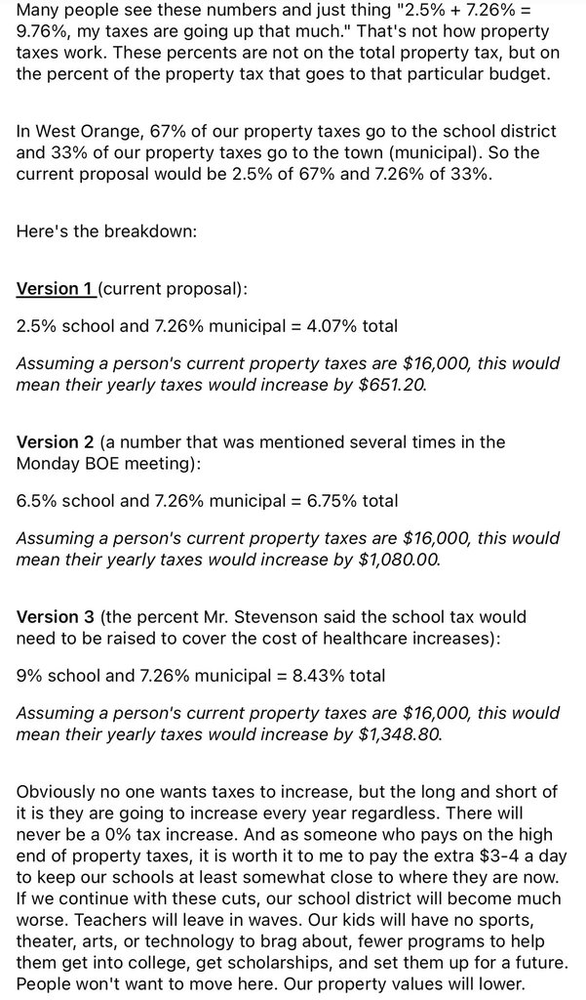

# Tax Math: What a School Tax Increase Actually Costs

> **Heads up — these numbers are community math, not official.** The
> calculations on this page come from a screenshot circulating in local
> PTA channels. The *math itself* is internally consistent, but several
> of the inputs — the 67/33 school-vs-municipal split, the 7.26%
> municipal figure, the 6.5% and 9% alternative school
> scenarios — are community-attributed and have not been confirmed
> against district or township records. That's a problem this page
> exists to illustrate as much as solve. See [What's verified vs.
> unverified](#whats-verified-vs-unverified) below.

---

## The core insight

Many people hear "2.5% school tax increase" and read it as "my taxes
are going up 2.5%." That's not how property tax math works in NJ. The
2.5% applies only to the **school portion** of your tax bill. And in
West Orange, the screenshot says schools are 67% of your property tax and municipal 33%; the township's 2025 proposed budget puts it closer to 61% school, 28% municipal, 11% county (see [below](#whats-verified-vs-unverified)).

So a 2.5% school increase combined with a 7.26% municipal increase
doesn't become "9.76% higher taxes." It becomes a *weighted average*
across the two portions — and the weighted number falls between the two figures and well below their sum.

## Three scenarios

All three use the same formula:

> **Blended increase** = (school % × school share of bill) + (municipal % × municipal share of bill)

Using the community-circulating 67% school / 33% municipal split:

### Version 1 — Current proposal

| School | Municipal | Blended increase |
|--------|-----------|------------------|
| 2.5%   | 7.26%     | **4.07%**        |

Worked out: `(0.025 × 0.67) + (0.0726 × 0.33)` = `0.01675 + 0.02396` = `0.04071` → **4.07%**

On a $16,000 annual property tax bill: **+$651/year** (≈ $54/month, ≈ $1.80/day).

### Version 2 — A figure mentioned at the Monday BOE meeting

| School | Municipal | Blended increase |
|--------|-----------|------------------|
| 6.5%   | 7.26%     | **6.75%**        |

On a $16,000 bill: **+$1,080/year** (≈ $90/month, ≈ $3/day).

### Version 3 — What it would take to fully cover healthcare increases

The screenshot describes this as the school tax increase a board member said would be needed to cover the cost of the healthcare increases.

| School | Municipal | Blended increase |
|--------|-----------|------------------|
| 9%     | 7.26%     | **8.43%**        |

On a $16,000 bill: **+$1,349/year** (≈ $112/month, ≈ $3.70/day).

## Run the numbers on your own bill

The daily-dollar framing shifts depending on your actual tax bill. To
plug in your own number:

1. Find your total annual property tax (on your tax bill, or look it
   up at [tax.munidex.info/westorange-nj-0722](https://tax.munidex.info/westorange-nj-0722) —
   search by name + address, includes historical assessments and taxes by year).
2. Multiply by the blended increase percentage above (e.g., 4.07% →
   × 0.0407).
3. Divide by 365 for a daily figure, or 12 for monthly.

So on a $12,000 bill under Version 1: `$12,000 × 0.0407 = $488/year` ≈
$1.34/day. On a $24,000 bill: `$24,000 × 0.0407 = $977/year` ≈ $2.68/day.

## What's verified vs. unverified

What the math *correctly* computes, given the inputs:

- ✅ The blended-percentage formula itself is sound
- ✅ Each row's arithmetic checks out
- ✅ The core insight — that a 2.5% school increase does not equal a
  2.5% increase on your total bill — is structurally correct

What is **community-attributed and should be confirmed against primary
sources**:

- ❗ **The 67% / 33% split is off.** The township's 2025 proposed budget puts schools at about 61%, municipal (with library and open space) at about 28%, and Essex County at about 11% ([2025 proposed municipal budget](https://westorange.org/DocumentCenter/View/14661/2025-Proposed-Municipal-Budget), p.6). The blended figures above use the screenshot's 67/33 and are kept as the screenshot had them. For comparison, Township Council member Joe Krakoviak's April 2026 projection of the total increase on an average bill, as reported by Patch, was 4.12% ([Patch](https://patch.com/new-jersey/westorange/proposed-tax-hike-west-orange-town-budget-sparks-criticism-questions)).
- ❓ **The 7.26% municipal increase.** No primary township budget link
  accompanies this figure in the screenshot.
- ❓ **The 6.5% and 9% school scenarios.** Attributed by the screenshot to the April 20 BOE meeting (6.5%) and to board member Mr. Stevenson (9%). The posted minutes are action minutes and do not record either figure; the meeting video, if one exists, would be the place to confirm.
- ❓ **The $16,000 baseline** is an illustrative example, not a West
  Orange median. Your bill could be meaningfully higher or lower.

This is exactly the kind of information that should live in an official,
citable place — ideally a district or township page with current-year
numbers and downloadable source documents. Which is part of why we
propose an [Open Budget & Participatory Finance](14-open-budget-tools)
module and [Open Governance](06-open-governance) practices. A screenshot
in a PTA group chat shouldn't be load-bearing civic infrastructure.

A few sites and sources usually exist with public information, but they
are sporadic and not always very clear or complete.

## Sponsor a Neighbor

Every scenario above has the same problem: a flat tax increase hits
residents very unevenly. A dual-income household and a retiree on
fixed income pay the same *percentage* increase even though the
*burden* is radically different.

One answer is to strengthen existing NJ relief programs (Senior Freeze,
Homestead/ANCHOR) through better outreach — many eligible residents
never enroll. But those are bureaucratic and slow. Another answer,
which the community can start *today*, is informal:

**Sponsor a neighbor.** If you can comfortably absorb a few hundred
dollars a year, you offer to cover the increase for a household that
can't. No government forms, no means-testing paperwork, no tax code
changes — just neighbors helping neighbors, organized through the PTA,
a local faith community, or a simple shared list. For the
*organized-service* cousin of this idea — where community donations
fund ongoing things like lawncare or snow removal for teachers — see
the [Mutualism](appendix-mutualism) appendix.

I (the site author) would be happy to cover several local residents if
needed, and I'd help build the coordination layer to organize it more
broadly — a lightweight way to match households who want to sponsor
with households who need sponsorship, with appropriate privacy.

### Why informal, and the trade-offs

Going community-to-community rather than through the tax process itself
has real advantages:

- **No red tape.** We don't need statutory authority, a dedicated line
  item, or approval from multiple layers of government to help a
  neighbor.
- **Fast.** It can start organizing this year. This month. This week.
- **Flexible.** The definition of "needs help" can be set by the people
  actually involved, not by an eligibility threshold set in Trenton.
- **Reinforces community trust.** The point isn't just the money — it's
  the visible fact that neighbors are showing up for each other.

And the honest drawbacks:

- **Not tax-deductible** the way a qualified charitable contribution
  might be. (A pooled fund run by a 501(c)(3), a fiscal sponsor, or a [PTA as community OS](16-pta-opencollective) collective, one that decides on its own who gets help, might make donations deductible if the effort grows. One-to-one matches with a specific household generally would not be, even if they pass through a charity. Check with a tax professional.)
- **Not scalable to everyone.** Informal sponsorship helps a handful of
  neighbors, not thousands. For broader equity, the formal relief
  programs and ultimately state-level funding formula reform still
  matter.
- **No guarantees.** A sponsor who loses their job next year can't be
  compelled to keep covering someone. The structure is a handshake,
  not a contract — which is a feature for speed and a limitation for
  durability.
- **Privacy considerations.** Matching sponsors with recipients needs
  care. Nobody should feel publicly identified as "the neighbor who
  needed help."

None of these trade-offs are reasons not to start. They're reasons to
think through the structure as we go, and to treat this as a
*complement* to — not a replacement for — formal relief programs and
state-level advocacy.

### How to get involved

It is too early to outright volunteer to cover a tax we don't know
the details of yet. But we could still discuss and organize. Anybody
interested in helping organize the matching logistics — reach out:
**volunteer@frontstate.org** or submit an issue to the
[GitHub repo](https://github.com/SiliconSaga/schools/issues)

## How to get official numbers

If you want to confirm (or correct) any figure on this page against
primary sources, the starting points are:

- **The district budget.** The BOE's User-Friendly Budget and annual
  comprehensive financial report should contain the school tax levy,
  the proposed rate, and the effective tax rate per $100 of assessed
  value.
- **The township tax rate table.** The municipal clerk / tax
  assessor's office publishes the split among school, municipal, and
  county portions. The township's [2025 proposed municipal budget](https://westorange.org/DocumentCenter/View/14661/2025-Proposed-Municipal-Budget) lists the components of the tax levy on p.6.
- **Essex County budget.** For the county portion specifically.
- **BOE meeting minutes and slides.** The April 20, 2026 meeting in
  particular, for the 6.5% and 9% figures attributed verbally.

If anyone reading this has links to those primary sources, please
[file an issue](https://github.com/SiliconSaga/schools/issues) and
we'll cite them here and remove the "❓" marks above.

As of this writing (2026-04-23) the minutes from the prior Monday BoE meeting had not yet been posted. The [April 20 minutes](https://www.woboe.org/fs/resource-manager/view/cc05598b-a60d-4d1b-ad68-3b1c0a1b385a) have since been posted. They record votes, not discussion, so the 6.5% and 9% figures are not in them. The [May 4 minutes](https://www.woboe.org/fs/resource-manager/view/1f4266c6-2009-4e98-80dd-e6882d807cb8) record total school taxes to be raised of $168,740,972 and a health-care costs adjustment of $797,076.

## Source screenshot

The community math on this page comes from this screenshot, shared via
a West Orange PTA channel. Author unattributed.

---

Related:
- [The Action Plan — Prong 1](bigger-picture-action#prong-1-right-now-tax-bridge--temporary-sacrifice)
  for where the "sponsor a neighbor" idea fits in the broader strategy.
- [Open Budget & Participatory Finance](14-open-budget-tools) for the
  infrastructure that would make this kind of math officially citable.
- [Open Governance](06-open-governance) for the process changes that
  would mean BOE meeting figures are captured and sourceable rather
  than relayed through screenshots.
